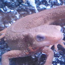

# Q. 1 - 10

## Q.1. チャネル入れ替え

画像を読み込み、RGBをBGRの順に入れ替えよ。

画像の赤成分を取り出すには、以下のコードで可能。
cv2.imread()関数ではチャネルがBGRの順になることに注意！
これで変数redにimori.jpgの赤成分のみが入る。

```python
import cv2
img = cv2.imread("imori.jpg")
red = img[:, :, 2].copy()
```

|入力 (imori.jpg)|出力 (answers_image/answer_1.jpg)|
|:---:|:---:|
|||

答え 
- Python >> [answers_py/answer_1.py](answers_py/answer_1.py)
- C++ >> [answers_cpp/answer_1.cpp](answers_cpp/answer_1.cpp)

## Q.2. グレースケール化

画像をグレースケールにせよ。
グレースケールとは、画像の輝度表現方法の一種であり下式で計算される。

Y = 0.2126 R + 0.7152 G + 0.0722 B

|入力 (imori.jpg)|出力 (answers_image/answer_2.jpg)|
|:---:|:---:|
|||

答え
- Python >> [answers_py/answer_2.py](answers_py/answer_2.py)
- C++ >> [answers_cpp/answer_2.cpp](answers_cpp/answer_2.cpp)
## Q.3. 二値化

画像を二値化せよ。
二値化とは、画像を黒と白の二値で表現する方法である。
ここでは、グレースケールにおいて閾値を128に設定し、下式で二値化する。

```bash
y = { 0 (if y < 128)
     255 (else) 
```

|入力 (imori.jpg)|出力 (answers_image/answer_3.jpg)|
|:---:|:---:|
|||

答え 
- Python >> [answers_py/answer_3.py](answers_py/answer_3.py)
- C++ >> [answers_cpp/answer_3.cpp](answers_cpp/answer_3.cpp)
## Q.4. 大津の二値化

大津の二値化を実装せよ。
大津の二値化とは判別分析法と呼ばれ、二値化における分離の閾値を自動決定する手法である。
これは**クラス内分散**と**クラス間分散**の比から計算される。

グレースケールの輝度値（ピクセルの値）のヒストグラムはこうなる。

```python
import cv2
import matplotlib.pyplot as plt
img = cv2.imread('assets/imori.jpg')
gray = 0.2126 * img[..., 2] + 0.7152 * img[..., 1] + 0.0722 * img[..., 0]
plt.hist(gray.ravel(), bins=255, rwidth=0.8, range=(0, 255))
plt.xlabel('value')
plt.ylabel('appearance')
plt.show()
```


二値化はある値を境界にして、０か１にする方法だけど、

- 閾値t未満をクラス0, t以上をクラス1とする。
- w0, w1 ... 閾値tにより分離された各クラスの画素数の割合 (w0 + w1 = 1を満たす)
- S0^2, S1^2 ... 各クラスの画素値の分散
- M0, M1 ... 各クラスの画素値の平均値


とすると、


となり、分離度Xは次式で定義される。


<!--
```bash
クラス内分散 Sw^2 = w0 * S0^2 + w1 * S1^2
クラス間分散 Sb^2 = w0 * (M0 - Mt)^2 + w1 * (M1 - Mt)^2 = w0 * w1 * (M0 - M1) ^2
画像全体の画素の分散 St^2 = Sw^2 + Sb^2 = (const)
以上より、分離度は次式で定義される。
分離度 X = Sb^2 / Sw^2 = Sb^2 / (St^2 - Sb^2)
```
-->

となるので、


<!--
```bash
argmax_{t} X = argmax_{t} Sb^2
```
-->


となる。すなわち、Sb^2 =  w0 * w1 * (M0 - M1) ^2 が最大となる、閾値tを二値化の閾値とすれば良い。

|入力 (imori.jpg)|出力 (th = 127) (answers_image/answer_4.jpg)|
|:---:|:---:|
|||

答え
- Python >> [answers_py/answer_4.py](answers_py/answer_4.py)
- C++ >> [answers_cpp/answer_4.cpp](answers_cpp/answer_4.cpp)

## Q.5. HSV変換

HSV変換を実装して、色相Hを反転せよ。

HSV変換とは、**Hue(色相)**、**Saturation(彩度)**、**Value(明度)** で色を表現する手法である。

- Hue ... 色合いを0~360度で表現し、赤や青など色の種類を示す。 ( 0 <= H < 360) 色相は次の色に対応する。

```bash
赤 黄色  緑  水色  青  紫   赤
0  60  120  180 240 300 360
```

- Saturation ... 色の鮮やかさ。Saturationが低いと灰色さが顕著になり、くすんだ色となる。 ( 0<= S < 1)
- Value ... 色の明るさ。Valueが高いほど白に近く、Valueが低いほど黒に近くなる。 ( 0 <= V < 1)

RGB -> HSV変換は以下の式で定義される。

R,G,Bが[0, 1]の範囲にあるとする。

```bash
Max = max(R,G,B)
Min = min(R,G,B)

H =  { 0                            (if Min=Max)
       60 x (G-R) / (Max-Min) + 60  (if Min=B)
       60 x (B-G) / (Max-Min) + 180 (if Min=R)
       60 x (R-B) / (Max-Min) + 300 (if Min=G)
       
V = Max

S = Max - Min
```

HSV -> RGB変換は以下の式で定義される。

```bash
C = S

H' = H / 60

X = C (1 - |H' mod 2 - 1|)

(R,G,B) = (V - C) (1,1,1) + { (0, 0, 0)  (if H is undefined)
                              (C, X, 0)  (if 0 <= H' < 1)
                              (X, C, 0)  (if 1 <= H' < 2)
                              (0, C, X)  (if 2 <= H' < 3)
                              (0, X, C)  (if 3 <= H' < 4)
                              (X, 0, C)  (if 4 <= H' < 5)
                              (C, 0, X)  (if 5 <= H' < 6)
```
ここでは色相Hを反転(180を加算)し、RGBに直し画像を表示せよ。

|入力 (imori.jpg)|出力 (answers_image/answer_5.jpg)|
|:---:|:---:|
|||

答え 
- Python >> [answers_py/answer_5.py](answers_py/answer_5.py)
- C++ >> [answers_cpp/answer_5.cpp](answers_cpp/answer_5.cpp)

## Q.6. 減色処理

ここでは画像の値を256^3から4^3、すなわちR,G,B in {32, 96, 160, 224}の各4値に減色せよ。
これは量子化操作である。
各値に関して、以下の様に定義する。

```bash
val = {  32  (  0 <= val <  64)
         96  ( 64 <= val < 128)
        160  (128 <= val < 192)
        224  (192 <= val < 256)
```
|入力 (imori.jpg)|出力 (answers_image/answer_6.jpg)|
|:---:|:---:|
|||

答え 
- Python >> [answers_py/answer_6.py](answers_py/answer_6.py)
- C++ >> [answers_cpp/answer_6.cpp](answers_cpp/answer_6.cpp)

## Q.7. 平均プーリング

ここでは画像をグリッド分割(ある固定長の領域に分ける)し、かく領域内(セル)の平均値でその領域内の値を埋める。
このようにグリッド分割し、その領域内の代表値を求める操作は**Pooling(プーリング)** と呼ばれる。
これらプーリング操作は**CNN(Convolutional Neural Network)** において重要な役割を持つ。

これは次式で定義される。

```bash
v = 1/|R| * Sum_{i in R} v_i
```

ここではimori.jpgは128x128なので、8x8にグリッド分割し、平均プーリングせよ。

|入力 (imori.jpg)|出力 (answers_image/answer_7.jpg)|
|:---:|:---:|
|||

答え 
- Python >> [answers_py/answer_7.py](answers_py/answer_7.py)
- C++ >> [answers_cpp/answer_7.cpp](answers_cpp/answer_7.cpp)

## Q.8. Maxプーリング

ここでは平均値でなく最大値でプーリングせよ。

|入力 (imori.jpg)|出力 (answers_image/answer_8.jpg)|
|:---:|:---:|
|||

答え
- Python >> [answers_py/answer_8.py](answers_py/answer_8.py)
- C++ >> [answers_cpp/answer_8.cpp](answers_cpp/answer_8.cpp)

NOW:

## Q.9. ガウシアンフィルタ

ガウシアンフィルタ(3x3、標準偏差1.3)を実装し、*imori_noise.jpg*のノイズを除去せよ。

ガウシアンフィルタとは画像の**平滑化**（滑らかにする）を行うフィルタの一種であり、**ノイズ除去**にも使われる。

ノイズ除去には他にも、メディアンフィルタ(Q.10)、平滑化フィルタ(Q.11)、LoGフィルタ(Q.19)などがある。

ガウシアンフィルタは注目画素の周辺画素を、ガウス分布による重み付けで平滑化し、次式で定義される。
このような重みは**カーネル**や**フィルタ**と呼ばれる。

ただし、画像の端はこのままではフィルタリングできないため、画素が足りない部分は0で埋める。これを**0パディング**と呼ぶ。
かつ、重みは正規化する。(sum g = 1)

重みはガウス分布から次式になる。


```bash
重み g(x,y,s) = 1/ (2 * pi * sigma * sigma) * exp( - (x^2 + y^2) / (2*s^2))
標準偏差s = 1.3による8近傍ガウシアンフィルタは
            1 2 1
K =  1/16 [ 2 4 2 ]
            1 2 1
```

|入力 (imori_noise.jpg)|出力 (answers_image/answer_9.jpg)|
|:---:|:---:|
|||

答え 
- Python >> [answers_py/answer_9.py](answers_py/answer_9.py)
- C++ >> [answers_cpp/answer_9.cpp](answers_cpp/answer_9.cpp)

## Q.10 メディアンフィルタ

メディアンフィルタ(3x3)を実装し、*imori_noise.jpg*のノイズを除去せよ。

メディアンフィルタとは画像の平滑化を行うフィルタの一種である。

これは注目画素の3x3の領域内の、メディアン値(中央値)を出力するフィルタである。
これもゼロパディングせよ。

|入力 (imori_noise.jpg)|出力 (answers_image/answer_10.jpg)|
|:---:|:---:|
|||

答え 
- Python >> [answers_py/answer_10.py](answers_py/answer_10.py)
- C++ >> [answers_cpp/answer_10.cpp](answers_cpp/answer_10.cpp)

# Q.11 - 20

## Q.11. 平滑化フィルタ

平滑化フィルタ(3x3)を実装せよ。

平滑化フィルタはフィルタ内の画素の平均値を出力するフィルタである。

|入力 (imori.jpg)|出力 (answers_image/answer_11.jpg)|
|:---:|:---:|
|||

答え
- Python >> [answers_py/answer_11.py](answers_py/answer_11.py)
- C++ >> [answers_cpp/answer_11.cpp](answers_cpp/answer_11.cpp)

## Q.12. モーションフィルタ

モーションフィルタ(3x3)を実装せよ。

モーションフィルタとは対角方向の平均値を取るフィルタであり、次式で定義される。

```bash
  1/3  0   0
[  0  1/3  0 ]
   0   0  1/3
```

|入力 (imori.jpg)|出力 (answers_image/answer_12.jpg)|
|:---:|:---:|
|||

答え
- Python >> [answers_py/answer_12.py](answers_py/answer_12.py)
- C++ >> [answers_cpp/answer_12.cpp](answers_cpp/answer_12.cpp)

## Q.13. MAX-MINフィルタ

MAX-MINフィルタ(3x3)を実装せよ。

MAX-MINフィルタとはフィルタ内の画素の最大値と最小値の差を出力するフィルタであり、**エッジ検出**のフィルタの一つである。
エッジ検出とは画像内の線を検出るすることであり、このような画像内の情報を抜き出す操作を**特徴抽出**と呼ぶ。
エッジ検出では多くの場合、グレースケール画像に対してフィルタリングを行う。

|入力 (imori.jpg)|出力 (answers_image/answer_13.jpg)|
|:---:|:---:|
|||

答え 
- Python >> [answers_py/answer_13.py](answers_py/answer_13.py)
- C++ >> [answers_cpp/answer_13.cpp](answers_cpp/answer_13.cpp)

## Q.14. 微分フィルタ

微分フィルタ(3x3)を実装せよ。

微分フィルタは輝度の急激な変化が起こっている部分のエッジを取り出すフィルタであり、隣り合う画素同士の差を取る。

```bash
    (a)縦方向         (b)横方向
      0 -1  0            0 0 0
K = [ 0  1  0 ]   K = [ -1 1 0 ]
      0  0  0            0 0 0
```

|入力 (imori.jpg)|出力・縦方向 (answers_image/answer_14_v.jpg)|出力・横方向 (answers_image/answer_14_h.jpg)|
|:---:|:---:|:---:|
||||

答え
- Python >>[ answers_py/answer_14.py](answers_py/answer_14.py)
- C++ >> [answers_cpp/answer_14.cpp](answers_cpp/answer_14.cpp)

## Q.15. Sobelフィルタ

Sobelフィルタ(3x3)を実装せよ。

ソーベルフィルタ(Sobelフィルタ)は特定方向（縦や横）のエッジのみを抽出するフィルタであり、次式でそれぞれ定義される。

```bash
    (a)縦方向       (b)横方向
       1  2  1           1  0 -1
K = [  0  0  0 ]   K = [ 2  0 -2 ]
      -1 -2 -1           1  0 -1
```

|入力 (imori.jpg)|出力・縦方向 (answers_image/answer_15_v.jpg)|出力・横方向 (answers_image/answer_15_h.jpg)|
|:---:|:---:|:---:|
||||

答え
- Python >> [answers_py/answer_15.py](answers_py/answer_15.py)
- C++ >> [answers_cpp/answer_15.cpp](answers_cpp/answer_15.cpp)


## Q.16. Prewittフィルタ

Prewittフィルタ(3x3)を実装せよ。

Prewittフィルタはエッジ抽出フィルタの一種であり、次式で定義される。

```bash
    (a)縦方向          (b)横方向
      -1 -1 -1          -1 0 1
K = [  0  0  0 ]  K = [ -1 0 1 ]
       1  1  1          -1 0 1
```

|入力 (imori.jpg)|出力・縦方向 (answers_image/answer_16_v.jpg)|出力・横方向 (answers_image/answer_16_h.jpg)|
|:---:|:---:|:---:|
||||

答え
- Python >> [answers_py/answer_16.py](answers_py/answer_16.py)
- C++ >> [answers_cpp/answer_16.cpp](answers_cpp/answer_16.cpp)

## Q.17. Laplacianフィルタ

Laplacianフィルタを実装せよ。

Laplacian（ラプラシアン）フィルタとは輝度の二次微分をとることでエッジ検出を行うフィルタである。

デジタル画像は離散データであるので、x方向・y方向の一次微分は、それぞれ次式で表される。

```bash
Ix(x,y) = (I(x+1, y) - I(x,y)) / ((x+1)-x) = I(x+1, y) - I(x,y)
Iy(x,y) = (I(x, y+1) - I(x,y)) / ((y+1)-y) = I(x, y+1) - I(x,y)
```

さらに二次微分は、次式で表される。

```bash
Ixx(x,y) = (Ix(x,y) - Ix(x-1,y)) / ((x+1)-x) = Ix(x,y) - Ix(x-1,y)
         = (I(x+1, y) - I(x,y)) - (I(x, y) - I(x-1,y))
         = I(x+1,y) - 2 * I(x,y) + I(x-1,y)
Iyy(x,y) = ... = I(x,y+1) - 2 * I(x,y) + I(x,y-1)
```

これらより、ラプラシアン は次式で定義される。

```bash
D^2 I(x,y) = Ixx(x,y) + Iyy(x,y)
           = I(x-1,y) + I(x,y-1) - 4 * I(x,y) + I(x+1,y) + I(x,y+1)
```

これをカーネル化すると、次のようになる。

```bash
      0  1  0
K = [ 1 -4  1 ]
      0  1  0
```

|入力 (imori.jpg)|出力(answers_image/answer_17.jpg)|
|:---:|:---:|
||||

答え
- Python >> [answers_py/answer_17.py](answers_py/answer_17.py)
- C++ >> [answers_cpp/answer_17.cpp](answers_cpp/answer_17.cpp)

## Q.18. Embossフィルタ

Embossフィルタを実装せよ。

Embossフィルタとは輪郭部分を浮き出しにするフィルタで、次式で定義される。

```bash
      -2 -1  0
K = [ -1  1  1 ]
       0  1  2
```

|入力 (imori.jpg)|出力(answers_image/answer_18.jpg)|
|:---:|:---:|
|||

答え
- Python >> [answers_py/answer_18.py](answers_py/answer_18.py)
- C++ >> [answers_cpp/answer_18.cpp](answers_cpp/answer_18.cpp)

## Q.19. LoGフィルタ

LoGフィルタ(sigma=3、カーネルサイズ=5)を実装し、*imori_noise.jpg*のエッジを検出せよ。

LoGフィルタとはLaplacian of Gaussianであり、ガウシアンフィルタで画像を平滑化した後にラプラシアンフィルタで輪郭を取り出すフィルタである。

Laplcianフィルタは二次微分をとるのでノイズが強調されるのを防ぐために、予めGaussianフィルタでノイズを抑える。

LoGフィルタは次式で定義される。

```bash
LoG(x,y) = (x^2 + y^2 - sigma^2) / (2 * pi * sigma^6) * exp(-(x^2+y^2) / (2*sigma^2))
```

|入力 (imori_noise.jpg)|出力 (answers_image/answer_19.jpg) |
|:---:|:---:|
|||

答え 
- Python >> [answers_py/answer_19.py](answers_py/answer_19.py)
- C++ >> [answers_cpp/answer_19.cpp](answers_cpp/answer_19.cpp)

## Q.20. ヒストグラム表示

matplotlibを用いて*imori_dark.jpg*のヒストグラムを表示せよ。

ヒストグラムとは画素の出現回数をグラフにしたものである。
matplotlibではhist()という関数がすでにあるので、それを利用する。

|入力 (imori_dark.jpg)|出力 (answers_image/answer_20.png) |
|:---:|:---:|
|||

答え >> [answers_py/answer_20.py](answers_py/answer_20.py)


# Q. 21 - 30


## Q.21. ヒストグラム正規化

#### Histogram normalization

ヒストグラム正規化を実装せよ。

ヒストグラムは偏りを持っていることが伺える。
例えば、0に近い画素が多ければ画像は全体的に暗く、255に近い画素が多ければ画像は明るくなる。
ヒストグラムが局所的に偏っていることを**ダイナミックレンジが狭い**などと表現する。
そのため画像を人の目に見やすくするために、ヒストグラムを正規化したり平坦化したりなどの処理が必要である。

このヒストグラム正規化は**濃度階調変換(gray-scale transformation)** と呼ばれ、[c,d]の画素値を持つ画像を[a,b]のレンジに変換する場合は次式で実現できる。
今回は*imori_dark.jpg*を[0, 255]のレンジにそれぞれ変換する。


<!--
```bash
xout = {  a                         (xin < c)
         (b-a)/(d-c) * (xin-c) + a  (c <= xin <= d)
          b                         (d < xin)
```
-->

|入力 (imori_dark.jpg)|出力 (answers_image/answer_21_1.jpg) |ヒストグラム(answers_image/answer_21_2.png)|
|:---:|:---:|:---:|
||||

答え 
- Python >> [answers_py/answer_21.py](answers_py/answer_21.py)
- C++ >> [answers_cpp/answer_21.cpp](answers_cpp/answer_21.cpp)

## Q.22. ヒストグラム操作

ヒストグラムの平均値をm0=128、標準偏差をs0=52になるように操作せよ。

これはヒストグラムのダイナミックレンジを変更するのではなく、ヒストグラムを平坦に変更する操作である。

平均値m、標準偏差s、のヒストグラムを平均値m0, 標準偏差s0に変更するには、次式によって変換する。


<!--
```bash
xout = s0 / s * (xin - m) + m0
```
-->

|入力 (imori_dark.jpg)|出力 (answers_image/answer_22_1.jpg) |ヒストグラム(answers_image/answer_22_2.png)|
|:---:|:---:|:---:|
||||

答え 
- Python >> [answers_py/answer_22.py](answers_py/answer_22.py)
- C++ >> [answers_cpp/answer_22.cpp](answers_cpp/answer_22.cpp)

## Q.23. ヒストグラム平坦化

#### Histogram equalization

ヒストグラム平坦化を実装せよ。

ヒストグラム平坦化とはヒストグラムを平坦に変更する操作であり、上記の平均値や標準偏差などを必要とせず、ヒストグラム値を均衡にする操作である。

これは次式で定義される。
ただし、S ... 画素値の総数、Zmax ... 画素値の最大値、h(z) ... 濃度zの度数


<!--
```bash
Z' = Zmax / S * Sum{i=0:z} h(z)
```
-->

|入力 (imori.jpg)|出力 (answers_image/answer_23_1.jpg) |ヒストグラム(answers_image/answer_23_2.png)|
|:---:|:---:|:---:|
||||

答え 
- Python >> [answers_py/answer_23.py](answers_py/answer_23.py)
- C++ >> [answers_cpp/answer_23.cpp](answers_cpp/answer_23.cpp)


## Q.24. ガンマ補正

#### Gamma correction

*imori_gamma.jpg*に対してガンマ補正(c=1, g=2.2)を実行せよ。

ガンマ補正とは、カメラなどの媒体の経由によって画素値が非線形的に変換された場合の補正である。
ディスプレイなどで画像をそのまま表示すると画面が暗くなってしまうため、RGBの値を予め大きくすることで、ディスプレイの特性を排除した画像表示を行うことがガンマ補正の目的である。

非線形変換は次式で起こるとされる。
ただしxは[0,1]に正規化されている。
c ... 定数、g ... ガンマ特性(通常は2.2)


<!--
```bash
x' = c * Iin ^ g
```
-->

そこで、ガンマ補正は次式で行われる。


<!--
```bash
Iout = (1/c * Iin) ^ (1/g)
```
-->

 

|入力 (imori_gamma.jpg)|出力 (answers_image/answer_24.jpg)|
|:---:|:---:|
|||

答え 
- Python >> [answers_py/answer_24.py](answers_py/answer_24.py)
- C++ >> [answers_cpp/answer_24.cpp](answers_cpp/answer_24.cpp)

## Q.25. 最近傍補間

最近傍補間により画像を1.5倍に拡大せよ。

最近傍補間(Nearest Neighbor)は画像の拡大時に最近傍にある画素をそのまま使う手法である。
シンプルで処理速度が速いが、画質の劣化は著しい。

次式で補間される。
I' ... 拡大後の画像、 I ... 拡大前の画像、a ... 拡大率、[ ] ... 四捨五入


<!--
```bash
I'(x,y) = I([x/a], [y/a])
```
-->

|入力 (imori.jpg)|出力 (answers_image/answer_25.jpg)|
|:---:|:---:|
|||

答え 
- Python >> [answers_py/answer_25.py](answers_py/answer_25.py)
- C++ >> [answers_cpp/answer_25.cpp](answers_cpp/answer_25.cpp)

## Q.26. Bi-linear補間

Bi-linear補間により画像を1.5倍に拡大せよ。

Bi-linear補間とは周辺の４画素に距離に応じた重みをつけることで補完する手法である。
計算量が多いだけ処理時間がかかるが、画質の劣化を抑えることができる。

1. 拡大画像の座標(x', y')を拡大率aで割り、floor(x'/a, y'/a)を求める。
2. 元画像の(x'/a, y'/a)の周囲4画素、I(x,y), I(x+1,y), I(x,y+1), I(x+1, y+1)を求める


<!--
```bash
I(x,y)    I(x+1,y) 
     * (x'/a,y'/a)
I(x,y+1)  I(x+1,y+1)
```
-->

3. それぞれの画素と(x'/a, y'/a)との距離dを求め、重み付けする。 w = d / Sum d
4. 次式によって拡大画像の画素(x',y')を求める。 
dx = x'/a - x , dy = y'/a - y


<!--
```bash
I'(x',y') = (1-dx)(1-dy)I(x,y) + dx(1-dy)I(x+1,y) + (1-dx)dyI(x,y+1) + dxdyI(x+1,y+1)
```
-->

|入力 (imori.jpg)|出力 (answers_image/answer_26.jpg)|
|:---:|:---:|
|||

答え 
- Python >> [answers_py/answer_26.py](answers_py/answer_26.py)
- C++ >> [answers_cpp/answer_26.cpp](answers_cpp/answer_26.cpp)

## Q.27. Bi-cubic補間

Bi-cubic補間により画像を1.5倍に拡大せよ。

Bi-cubic補間とはBi-linear補間の拡張であり、周辺の16画素から補間を行う。


<!--
```bash
I(x-1,y-1)  I(x,y-1)  I(x+1,y-1)  I(x+2,y-1)
I(x-1,y)    I(x,y)    I(x+1,y)    I(x+2,y)
I(x-1,y+1)  I(x,y+1)  I(x+1,y+1)  I(x+2,y+1)
I(x-1,y+2)  I(x,y+2)  I(x+1,y+2)  I(x+2,y+2)
```
-->

それぞれの画素との距離は次式の様に決定される。


<!--
```bash
dx1 = x'/a - (x-1) , dx2 = x'/a - x , dx3 = (x+1) - x'/a , dx4 = (x+2) - x'/a
dy1 = y'/a - (y-1) , dy2 = y'/a - y , dy3 = (y+1) - y'/a , dy4 = (y+2) - y'/a
```
-->

重みは距離によって次の関数により決定される。
a は多くの場合-1をとる。だいたい図の青色のピクセルは距離|t|<=1、緑色が1<|t|<=2の重みとなる。


<!--
```bash
h(t) = { (a+2)|t|^3 - (a+3)|t|^2 + 1    (when |t|<=1)
         a|t|^3 - 5a|t|^2 + 8a|t| - 4a  (when 1<|t|<=2)
         0                              (when 2<|t|) 
```
-->

これら画素と重みを用いて、次式で拡大画像の画素が計算される。
それぞれの画素と重みを掛けた和を重みの和で割る。


<!--
```bash
I'(x', y') = (Sum{i=-1:2}{j=-1:2} I(x+i,y+j) * wxi * wyj) / Sum{i=-1:2}{j=-1:2} wxi * wyj
```
-->

|入力 (imori.jpg)|出力 (answers_image/answer_27.jpg)|
|:---:|:---:|
|||

答え 
- Python >> [answers_py/answer_27.py](answers_py/answer_27.py)
- C++ >> [answers_cpp/answer_27.cpp](answers_cpp/answer_27.cpp)

## Q.28. アフィン変換(平行移動)

アフィン変換を利用して画像をx方向に+30、y方向に-30だけ平行移動させよ。

アフィン変換とは3x3の行列を用いて画像の変換を行う操作である。

変換は(1)平行移動(Q.28) (2)拡大縮小(Q.29) (3)回転(Q.30) (4)スキュー(Q.31) がある。

元画像を(x,y)、変換後の画像を(x',y')とする。
画像の拡大縮小は、次式で表される。


<!--
```bash
[ x' ] = [a b][x]
  y'      c d  y
```
-->

一方、平行移動は次式となる。


<!--
```bash
[ x' ] = [x] + [tx]
  y'      y  +  ty
```
-->

以上を一つの式にまとめると、次式になり、これがアフィン変換である。


<!--
```bash
  x'       a b tx    x
[ y' ] = [ c d ty ][ y ]
  1        0 0  1    1
```
-->

しかし実装する時は、元画像に対して１ピクセルずつ行うと、処理後の画像で値が割り当てられない可能性がでてきてしまう。よって、処理後画像の各ピクセルに対してAffine変換の逆変換を行い、値をあ割り当てる元画像の座標を取得する必要がある。Affine変換の逆操作は次式となる。


今回の平行移動では次式を用いる。tx, tyが平行移動のピクセルの移動距離となる。


<!--
```bash
  x'       1 0 tx    x
[ y' ] = [ 0 1 ty ][ y ]
  1        0 0  1    1
```
-->

|入力 (imori.jpg)|出力 (answers_image/answer_28.jpg)|
|:---:|:---:|
|||

答え 
- Python >> [answers_py/answer_28.py](answers_py/answer_28.py)
- C++ >> [answers_cpp/answer_28.cpp](answers_cpp/answer_28.cpp)

## Q.29. アフィン変換(拡大縮小)

アフィン変換を用いて、(1)x方向に1.3倍、y方向に0.8倍にリサイズせよ。

また、(2)  (1)の条件に加えて、x方向に+30、y方向に-30だけ平行移動を同時に実現せよ。

|入力 (imori.jpg)|出力 (1) (answers_image/answer_29_1.jpg)|出力 (2) (answers_image/answer_29_2.jpg)|
|:---:|:---:|:---:|
||||

答え 
- Python >> [answers_py/answer_29.py](answers_py/answer_29.py)
- C++ >> [answers_cpp/answer_29.cpp](answers_cpp/answer_29.cpp)

## Q.30. アフィン変換(回転)

(1)アフィン変換を用いて、反時計方向に30度回転させよ。

(2) アフィン変換を用いて、反時計方向に30度回転した画像で中心座標を固定することで、なるべく黒い領域がなくなるように画像を作成せよ。
（ただし、単純なアフィン変換を行うと画像が切れてしまうので、工夫を要する。）

アフィン変換において、反時計方向にA度回転させる時は、次式となる。


<!--
```bash
  x'       cosA -sinA tx    x
[ y' ] = [ sinA  cosA ty ][ y ]
  1         0     0    1    1
```
-->

|入力 (imori.jpg)|出力 (1) (answers_image/answer_30_1.jpg)|出力 (2) (answers_image/answer_30_2.jpg)|
|:---:|:---:|:---:|
||||

答え >> 

答え 
- Python >> [answers_py/answer_30.py](answers_py/answer_30.py) , 
- C++ >> [answers_cpp/answer_30.cpp](answers_cpp/answer_30.cpp)

# Q. 31 - 40

## Q.31. アフィン変換(スキュー)

(1)アフィン変換を用いて、出力(1)のようなX-sharing(dx = 30)画像を作成せよ。

(2)アフィン変換を用いて、出力2のようなY-sharing(dy = 30)画像を作成せよ。

(3)アフィン変換を用いて、出力3のような幾何変換した(dx = 30, dy = 30)画像を作成せよ。

このような画像はスキュー画像と呼ばれ、画像を斜め方向に伸ばした画像である。

出力(1)の場合、x方向にdxだけ引き伸ばした画像はX-sharingと呼ばれる。

出力(2)の場合、y方向にdyだけ引き伸ばした画像はY-sharingと呼ばれる。

それぞれ次式のアフィン変換で実現できる。
ただし、元画像のサイズがh x wとする。

```bash
(1) X-sharing                  (2) Y-sharing
   a = dx / h                     a = dy / w

  x'       1 a tx    x           x'       1 0 tx    x
[ y' ] = [ 0 1 ty ][ y ]       [ y' ] = [ a 1 ty ][ y ]
  1        0 0  1    1           1        0 0  1    1
```

|入力 (imori.jpg)|出力 (1) (answers_image/answer_31_1.jpg)|出力 (2) (answers_image/answer_31_2.jpg)|出力 (3) (answers_image/answer_31_3.jpg)|
|:---:|:---:|:---:|:---:|
|||||

答え 
- Python >> [answers_py/answer_31.py](answers_py/answer_31.py)
- C++ >> [answers_cpp/answer_31.cpp](answers_cpp/answer_31.cpp)

## Q.32. フーリエ変換

二次元離散フーリエ変換(DFT)を実装し、*imori.jpg*をグレースケール化したものの周波数のパワースペクトルを表示せよ。
また、逆二次元離散フーリエ変換(IDFT)で画像を復元せよ。

二次元離散フーリエ変換(DFT: Discrete Fourier Transformation)とはフーリエ変換の画像に対する処理方法である。

通常のフーリエ変換はアナログ信号や音声などの連続値かつ一次元を対象に周波数成分を求める計算処理である。

一方、ディジタル画像は[0,255]の離散値をとり、かつ画像はHxWの二次元表示であるので、二次元離散フーリエ変換が行われる。

二次元離散フーリエ変換(DFT)は次式で計算される。

<!--
```bash
K = 0:W, l = 0:H, 入力画像をI として
G(k,l) = Sum_{y=0:H-1, x=0:W-1} I(x,y) exp( -2pi * j * (kx/W + ly/H)) / sqrt(H * W)
```
-->

K = [0, W-1], l = [0, H-1], 入力画像を I として


ここでは画像をグレースケール化してから二次元離散フーリエ変換を行え。

パワースペクトルとは Gは複素数で表されるので、Gの絶対値を求めることである。
今回のみ画像表示の時はパワースペクトルは[0,255]にスケーリングせよ。

逆二次元離散フーリエ変換(IDFT: Inverse DFT)とは周波数成分Gから元の画像を復元する手法であり、次式で定義される。

<!--
```bash
x = 0:W, y = 0:H  として
I(x,y) = Sum_{l=0:H-1, k=0:W-1} G(k,l) exp( 2pi * j * (kx/W + ly/H)) / sqrt(H * W)
```
-->
x = [0, W-1], y = [0, H-1] として


上が定義式ですがexp(j)は複素数の値をとってしまうので、実際にコードにするときはぜ下式のように絶対値を使います。


シンプルに全部for文で回すと128^4の計算になるので、時間がかかってしまいます。numpyをうまく活用すれば計算コストを減らすことができます。（解答は128^2まで減らしました。）

|入力 (imori.jpg) |出力 (answers_image/answer_32.jpg)|パワースペクトル (answers_image/answer_32_ps.py)
|:---:|:---:|:---:|
||||

答え 
- Python >> [answers_py/answer_32.py](answers_py/answer_32.py)
- C++ >> [answers_cpp/answer_32.cpp](answers_cpp/answer_32.cpp)

## Q.33. フーリエ変換　ローパスフィルタ

*imori.jpg*をグレースケール化したものをDFTし、ローパスフィルタを通してIDFTで画像を復元せよ。

DFTによって得られた周波数成分は左上、右上、左下、右下に近いほど低周波数の成分を含んでいることになり、中心に近いほど高周波成分を示す。


画像における高周波成分とは色が変わっている部分（ノイズや輪郭など）を示し、低周波成分とは色があまり変わっていない部分（夕日のグラデーションなど）を表す。
ここでは、高周波成分をカットし、低周波成分のみを通す**ローパスフィルタ**を実装せよ。

ここでは低周波数の中心から高周波までの距離をrとすると0.5rまでの成分を通すとする。

|入力 (imori.jpg)|出力 (answers_image/answer_33.jpg)|
|:---:|:---:|
|||

答え 
- Python >> [answers_py/answer_33.py](answers_py/answer_33.py)
- C++ >> [answers_cpp/answer_33.cpp](answers_cpp/answer_33.cpp)

## Q.34. フーリエ変換　ハイパスフィルタ

*imori.jpg*をグレースケール化したものをDFTし、ハイパスフィルタを通してIDFTで画像を復元せよ。

ここでは、低周波成分をカットし、高周波成分のみを通す**ハイパスフィルタ**を実装せよ。

ここでは低周波数の中心から高周波までの距離をrとすると0.1rからの成分を通すとする。

|入力 (imori.jpg)|出力 (answers_image/answer_34.jpg)|
|:---:|:---:|
|||

答え 
- Python >> [answers_py/answer_34.py](answers_py/answer_34.py)
- C++ >> [answers_cpp/answer_34.cpp](answers_cpp/answer_34.cpp)

## Q.35. フーリエ変換　バンドパスフィルタ

*imori.jpg*をグレースケール化したものをDFTし、ハイパスフィルタを通してIDFTで画像を復元せよ。

ここでは、低周波成分と高周波成分の中間の周波数成分のみを通す**ハイパスフィルタ**を実装せよ。

ここでは低周波数の中心から高周波までの距離をrとすると0.1rから0.5rまでの成分を通すとする。

|入力 (imori.jpg)|出力 (answers_image/answer_35.jpg)|
|:---:|:---:|
|||

答え 
- Python >> [answers_py/answer_35.py](answers_py/answer_35.py)
- C++ >> [answers_cpp/answer_35.cpp](answers_cpp/answer_35.cpp)

## Q.36. JPEG圧縮 (Step.1)離散コサイン変換

*imori.jpg*をグレースケール化し離散コサイン変換を行い、逆離散コサイン変換を行え。

離散コサイン変換(DCT: Discrete Cosine Transformation)とは、次式で定義される周波数変換の一つである。


<!--
```bash
T = 8
F(u,v) = 2 / T * C(u)C(v) * Sum_{y=0:T-1} Sum_{x=0:T-1} f(x,y) cos((2x+1)u*pi/2T) cos((2y+1)v*pi/2T)
```
-->

逆離散コサイン変換(IDCT: Inverse Discrete Cosine Transformation)とは離散コサイン変換の逆（復号）であり、次式で定義される。
ここでいう K は復元時にどれだけ解像度を良くするかを決定するパラメータである。
K = Tの時は、DCT係数を全部使うのでIDCT後の解像度は最大になるが、Kが１や２などの時は復元に使う情報量（DCT係数）が減るので解像度が下がる。これを適度に設定することで、画像の容量を減らすことができる。


<!--
```bash
T = 8
K = 8
f(x,y) = 2 / T * C(x)C(y) * Sum_{u=0:K-1} Sum_{v=0:K-1} F(u,v) cos((2x+1)u*pi/2T) cos((2y+1)v*pi/2T)
```
-->

ここでは画像を8x8ずつの領域に分割して、各領域で以上のDCT, IDCTを繰り返すことで、jpeg符号に応用される。
今回も同様に8x8の領域に分割して、DCT, IDCTを行え。

|入力 (imori.jpg)|出力 (answers_image/answer_36.jpg)|
|:---:|:---:|
|||

答え 
- Python >> [answers_py/answer_36.py](answers_py/answer_36.py)
- C++ >> [answers_cpp/answer_36.cpp](answers_cpp/answer_36.cpp)

## Q.37. PSNR

IDCTで用いるDCT係数を8でなく、4にすると画像の劣化が生じる。
入力画像とIDCT画像のPSNRを求めよ。また、IDCTによるビットレートを求めよ。

PSNR(Peak Signal to Noise Ratio)とは信号対雑音比と呼ばれ、画像がどれだけ劣化したかを示す。

PSNRが大きいほど、画像が劣化していないことを示し、次式で定義される。
MAXは取りうる値の最大値で[0,255]の表示なら MAX=255　となる。
また、MSEはMean Squared Error(平均二乗誤差)と呼ばれ、二つの画像の差分の二乗の平均値を示す。


<!--
```bash
PSNR = 10 * log10(MAX^2 / MSE)
MSE = Sum_{y=0:H-1} Sum_{x=0:W-1} (I1(x,y) - I2(x,y))^2 / (HW)
```
-->

ビットレートとは8x8でDCTを行い、IDCTでKxKの係数までを用いた時に次式で定義される。

```bash
bitrate = 8 * K^2 / 8^2
```

|入力 (imori.jpg)|出力 (answers_image/answer_37.jpg) (PSNR = 27.62, Bitrate=2.0)|
|:---:|:---:|
|||

答え 
- Python >> [answers_py/answer_37.py](answers_py/answer_37.py)
- C++ >> [answers_cpp/answer_37.cpp](answers_cpp/answer_37.cpp)

## Q.38. JPEG圧縮 (Step.2)DCT+量子化

DCT係数を量子化し、IDCTで復元せよ。また、その時の画像の容量を比べよ。

DCT係数を量子化することはjpeg画像にする符号化で用いられる手法である。

量子化とは、値を予め決定された区分毎に値を大まかに丸め込む作業であり、floorやceil, roundなどが似た計算である。

JPEG画像ではDCT係数を下記で表される量子化テーブルに則って量子化する。
この量子化テーブルはjpeg団体の仕様書から取った。
量子化では8x8の係数をQで割り、四捨五入する。その後Qを掛けることで行われる。
IDCTでは係数は全て用いるものとする。

```bash
Q = np.array(((16, 11, 10, 16, 24, 40, 51, 61),
              (12, 12, 14, 19, 26, 58, 60, 55),
              (14, 13, 16, 24, 40, 57, 69, 56),
              (14, 17, 22, 29, 51, 87, 80, 62),
              (18, 22, 37, 56, 68, 109, 103, 77),
              (24, 35, 55, 64, 81, 104, 113, 92),
              (49, 64, 78, 87, 103, 121, 120, 101),
              (72, 92, 95, 98, 112, 100, 103, 99)), dtype=np.float32)
```

量子化を行うと画像の容量が減っていることから、データ量が削減されたことが伺える。

|入力 (imori.jpg)|出力 (answers_image/answer_38.jpg) (7kb)|
|:---:|:---:|
|||

答え 
- Python >> [answers_py/answer_38.py](answers_py/answer_38.py)
- C++ >> [answers_cpp/answer_38.cpp](answers_cpp/answer_38.cpp)

## Q.39. JPEG圧縮 (Step.3)YCbCr表色系

YCbCr表色形において、Yを0.7倍してコントラストを暗くせよ。

YCbCr表色系とは、画像を明るさを表すY、輝度と青レベルの差Cb、輝度と赤レベルの差Crに分解する表現方法である。

これはJPEG変換で用いられる。

RGBからYCbCrへの変換は次式。

```bash
Y = 0.299 * R + 0.5870 * G + 0.114 * B
Cb = -0.1687 * R - 0.3313 * G + 0.5 * B + 128
Cr = 0.5 * R - 0.4187 * G - 0.0813 * B + 128
```

YCbCrからRGBへの変換は次式。

```bash
R = Y + (Cr - 128) * 1.402
G = Y - (Cb - 128) * 0.3441 - (Cr - 128) * 0.7139
B = Y + (Cb - 128) * 1.7718
```

|入力 (imori.jpg)|出力 (answers_image/answer_39.jpg) |
|:---:|:---:|
|||

答え 
- Python >> [answers_py/answer_39.py](answers_py/answer_39.py)
- C++ >> [answers_cpp/answer_39.cpp](answers_cpp/answer_39.cpp)

## Q.40. JPEG圧縮 (Step.4)YCbCr+DCT+量子化

YCbCr表色系にし、DCT後、Yを量子化テーブルQ1、CbとCrをQ2で量子化し、IDCTで画像を復元せよ。
また、画像の容量を比較せよ。

アルゴリズムは、
1. RGB を YCbCrに変換
2. YCbCrをDCT
3. DCTしたものを量子化
4. 量子化したものをIDCT
5. IDCTしたYCbCrをRGBに変換

これはJPEGで実際に使われるデータ量削減の手法であり、Q1,Q2はJPEGの仕様書に則って次式で定義される。

```bash
Q1 = np.array(((16, 11, 10, 16, 24, 40, 51, 61),
               (12, 12, 14, 19, 26, 58, 60, 55),
               (14, 13, 16, 24, 40, 57, 69, 56),
               (14, 17, 22, 29, 51, 87, 80, 62),
               (18, 22, 37, 56, 68, 109, 103, 77),
               (24, 35, 55, 64, 81, 104, 113, 92),
               (49, 64, 78, 87, 103, 121, 120, 101),
               (72, 92, 95, 98, 112, 100, 103, 99)), dtype=np.float32)

Q2 = np.array(((17, 18, 24, 47, 99, 99, 99, 99),
               (18, 21, 26, 66, 99, 99, 99, 99),
               (24, 26, 56, 99, 99, 99, 99, 99),
               (47, 66, 99, 99, 99, 99, 99, 99),
               (99, 99, 99, 99, 99, 99, 99, 99),
               (99, 99, 99, 99, 99, 99, 99, 99),
               (99, 99, 99, 99, 99, 99, 99, 99),
               (99, 99, 99, 99, 99, 99, 99, 99)), dtype=np.float32)
```

|入力 (imori.jpg) (13kb)|出力 (answers_image/answer_40.jpg) (9kb)|
|:---:|:---:|
|||

答え 
- Python >> [answers_py/answer_40.py](answers_py/answer_40.py)
- C++ >> [answers_cpp/answer_40.cpp](answers_cpp/answer_40.cpp)

# Q. 41 - 50

## Q.41. Cannyエッジ検出 (Step.1) エッジ強度

Q.41 - 43 ではエッジ検出手法の一つであるCanny法の理論となる。

Canny法は、
1. ガウシアンフィルタを掛ける
2. x, y方向のSobelフィルタを掛け、それらからエッジ強度とエッジ勾配を求める
3. エッジ勾配の値から、Non-maximum suppression によりエッジの細線化を行う
4. ヒステリシスによる閾値処理を行う

以上により、画像からエッジ部分を抜き出す手法である。

ここでは、1と2の処理を実装する。

処理手順は、
1. 画像をグレースケール化する
2. ガウシアンフィルタ(5x5, s=1.4)をかける
3. x方向、y方向のsobelフィルタを掛け、画像の勾配画像fx, fyを求め、勾配強度と勾配角度を次式で求める。

```bash
勾配強度 edge = sqrt(fx^2 + fy^2)
勾配角度 angle = arctan(fy / fx)
```

4. 勾配角度を次式に沿って、量子化する。

ただし、angleはradianから角度(degree)にして、-22.5から157.5の範囲をとるように値が修正してから、以下の計算を行う。

```bash
angle = {   0  (if -22.5 < angle <= 22.5)
           45  (if 22.5 < angle <= 67.5)
           90  (if 67.5 < angle <= 112.5)
          135  (if 112.5 < angle <= 157.5)
```

ただし、フィルタリングをパディングする際は、numpy.pad()を用いて、エッジの値でパディングせよ。

|入力 (imori.jpg) |出力(勾配強度) (answers_image/answer_41_1.jpg)|出力(勾配角度) (answers_image/answer_41_2.jpg)|
|:---:|:---:|:---:|
||||

答え 
- Python >> [answers_py/answer_41.py](answers_py/answer_41.py)
- C++ >> [answers_cpp/answer_41.cpp](answers_cpp/answer_41.cpp)

## Q.42. Cannyエッジ検出 (Step.2) 細線化

ここでは3を実装する。

Q.41で求めた勾配角度から、Non-maximum suppressionを行い、エッジ線を細くする（細線化）。

Non-maximum suppression(NMS)とは非最大値以外を除去する作業の総称である。（他のタスクでもこの名前はよく出る）

ここでは、注目している箇所の勾配角度の法線方向の隣接ピクセルの３つの勾配強度を比較して、最大値ならそのまま値をいじらずに、最大値でなければ強度を0にする、

つまり、勾配強度edge(x,y)に注目している際に、勾配角度angle(x,y)によって次式のようにedge(x,y)を変更する。

```bash
if angle(x,y)  = 0
 if edge(x,y), edge(x-1,y), edge(x+1,y)で edge(x,y)が最大じゃない
  then edge(x,y) = 0
if angle(x,y)  = 45
 if edge(x,y), edge(x-1,y+1), edge(x+1,y-1)で edge(x,y)が最大じゃない
  then edge(x,y) = 0
if angle(x,y)  = 90
 if edge(x,y), edge(x,y-1), edge(x,y+1)で edge(x,y)が最大じゃない
  then edge(x,y) = 0
if angle(x,y)  = 135
 if edge(x,y), edge(x-1,y-1), edge(x+1,y+1)で edge(x,y)が最大じゃない
  then edge(x,y) = 0
```

|入力 (imori.jpg) |出力 (answers_image/answer_42.jpg)|
|:---:|:---:|
|||

答え 
- Python >> [answers_py/answer_42.py](answers_py/answer_42.py)
- Python >> [answers_cpp/answer_42.cpp](answers_cpp/answer_42.cpp)

## Q.43. Cannyエッジ検出 (Step.3) ヒステリシス閾処理

ここでは4を実装する。これがCanny法の最後である。

ここでは、閾値により勾配強度の二値化を行うがCanny法では二つの閾値(HT: high thoresholdとLT: low threshold)を用いる。

はじめに、
1. 勾配強度edge(x,y)がHT以上の場合はedge(x,y)=255
2. LT以下のedge(x,y)=0
3.  LT < edge(x,y) < HTの時、周り８ピクセルの勾配強度でHTより大きい値が存在すれば、edge(x,y)=255

ここでは、HT=50, LT=20とする。ちなみに閾値の値は結果を見ながら判断するしかない。

以上のアルゴリズムによって、Canny法が行われる。

|入力 (imori.jpg) |出力 (answers_image/answer_43.jpg)|
|:---:|:---:|
|||

答え 
- Python >> [answers_py/answer_43.py](answers_py/answer_43.py)
- C++ >> [answers_cpp/answer_43.cpp](answers_cpp/answer_43.cpp)

## Q.44. Hough変換・直線検出 (Step.1) Hough変換

Q.44 - 46 ではHough変換を用いた直線検出を行う。

Hough変換とは、座標を直交座標から極座標に変換することにより数式に沿って直線や円など一定の形状を検出する手法である。
ある直線状の点では極座標に変換すると一定のr, tにおいて交わる。
その点が検出すべき直線を表すパラメータであり、このパラメータを逆変換すると直線の方程式を求めることができる。

方法としては、
1. エッジ画像(ここではCannyの出力)からエッジのピクセルにおいてHough変換を行う。
2. Hough変換後の値のヒストグラムをとり、極大点を選ぶ。
3. 極大点のr, tの値をHough逆変換して検出した直線のパラメータを得る。

となる。

ここでは、1のHough変換を行いヒストグラムを作成する。

アルゴリズムは、

1. 画像の対角線の長さrmaxを求める。
2. エッジ箇所(x,y)において、t = 0-179で一度ずつtを変えながら、次式によりHough変換を行う。

```bash
rho = x * cos(t) + y * sin(t)
```
3. 「ボーティング（投票）」 [2 x rmax, 180]のサイズの表を用意し、1で得たtable(rho, t) に1を足す。２で求めたrhoは[-rmax, rmax]の範囲を取るので、ボーティングの時には注意！

ボーティングでは、一定の箇所に集中する。

今回は*torino.jpg*を用いて、ボーディングした表を図示せよ。
Cannyのパラメータは, gaussian filter(5x5, s=1.4), HT = 100, LT = 30で使用せよ。

|入力 (thorino.jpg) |出力 (answers_image/answer_44.jpg)|
|:---:|:---:|
|||

答え 
- Python >> [answers_py/answer_44.py](answers_py/answer_44.py)
- C++ >> [answers_cpp/answer_44.cpp](answers_cpp/answer_44.cpp)

## Q.45. Hough変換・直線検出 (Step.2) NMS

ここでは2を実装する。

Q.44で得られた表では、ある一定の箇所付近に多く投票される。
ここでは、その付近の極大値を抜き出す操作を行え。

今回はボーディングが多い箇所を上位20個抜き出し、図示せよ。(C++の解答は上位30個にしてます。なんか20だと同じような結果にらなかったので、、)

NMSのアルゴリズムは、
1. 表において、周囲8マス(8近傍)より注目ピクセルの得票数が多ければそのまま。
2. 注目ピクセルの値が少なければ0にする。

|入力 (thorino.jpg) |出力 (answers_image/answer_45.jpg)|
|:---:|:---:|
|||

答え 
- Python >> [answers_py/answer_45.py](answers_py/answer_45.py)
- C++ >> [answers_cpp/answer_45.cpp](answers_cpp/answer_45.cpp)

## Q.46. Hough変換・直線検出 (Step.3) Hough逆変換

ここではQ.45.で得られた極大値をHough逆変換をして直線を描画する。これで、Hough変換による直線検出が完了する。

アルゴリズムは、
1. 極大点(r, t)を次式で逆変換する。

```bash
y = - cos(t) / sin(t) * x + r / sin(t)
x = - sin(t) / cos(t) * y + r / cos(t)
```

2. 1の逆変換を極大点ごとにy = 0 - H-1, x = 0 - W-1 で行い、入力画像に検出した直線を描画せよ。
ただし、描画するのは赤線(R,G,B) = (255, 0, 0)とする。

|入力 (thorino.jpg) |出力 (answers_image/answer_46.jpg)|
|:---:|:---:|
|||

答え 
- Python >> [answers_py/answer_46.py](answers_py/answer_46.py)
- C++ >> [answers_cpp/answer_46.cpp](answers_cpp/answer_46.cpp)

## Q.47. モルフォロジー処理(膨張)

Morphology Dilate

*imori.jpg*を大津の二値化したものに、モルフォロジー処理による膨張を2回行え。

モルフォロジー処理とは二値化画像の白(255)マス部分を4近傍(上下左右1マス)に膨張、または1マスだけ収縮させる処理をいう。

この膨張と収縮を何度も繰り返すことで1マスだけに存在する白マスを消したり(Q.49. オープニング処理)、本来つながってほしい白マスを結合させたりできる(Q.50. クロージング処理)。

モルフォロジー処理の膨張(Dilation)アルゴリズムは、
注目画素I(x, y)=0で、I(x, y-1), I(x-1, y), I(x+1, y), I(x, y+1)のどれか一つが255なら、I(x, y) = 255 とする。


つまり、上の処理を2回行えば2マス分膨張できることになる。

モルフォロジー処理の実装は例えば、[[0,1,0], [1,0,1], [0,1,0]] のフィルタを掛けた和が255以上なら膨張である、と考えることもできる。

|入力 (imori.jpg) |大津の二値化(answers_image/answer_4.jpg)|出力 (answers_image/answer_47.jpg)|
|:---:|:---:|:---:|
||||

答え 
- Python >> [answers_py/answer_47.py](answers_py/answer_47.py)
- C++ >> [answers_cpp/answer_47.cpp](answers_cpp/answer_47.cpp)

## Q.48. モルフォロジー処理(収縮)

*imori.jpg*を大津の二値化したものに、モルフォロジー処理による収縮を2回行え。

モルフォロジー処理の収縮(Erosion)アルゴリズムは、
注目画素I(x, y)=255で、I(x, y-1), I(x-1, y), I(x+1, y), I(x, y+1)のどれか一つでも0なら、I(x, y) = 0 とする。


収縮処理は例えば、[[0,1,0], [1,0,1], [0,1,0]] のフィルタを掛けた和が255*4未満なら収縮である、と考えることもできる。

|入力 (imori.jpg) |大津の二値化(answers_image/answer_4.jpg)|出力 (answers_image/answer_48.jpg)|
|:---:|:---:|:---:|
||||

答え 
- Python >> [answers_py/answer_48.py](answers_py/answer_48.py)
- C++ >> [answers_cpp/answer_48.cpp](answers_cpp/answer_48.cpp)

## Q.49. オープニング処理

**大津の二値化後**に、オープニング処理(N=1)を行え。

オープニング処理とは、モルフォロジー処理の収縮をN回行った後に膨張をN回行う処理である。


オープニング処理により、一つだけ余分に存在する画素などを削除できる。

|入力 (imori.jpg) |大津の二値化(answers_image/answer_4.jpg)|出力 (answers_image/answer_49.jpg)|
|:---:|:---:|:---:|
||||

答え 
- Python >> [answers_py/answer_49.py](answers_py/answer_49.py)
- C++ >> [answers_cpp/answer_49.cpp](answers_cpp/answer_49.cpp)

## Q.50. クロージング処理

**Canny検出した後**に、クロージング処理(N=1)を行え。

クロージング処理とは、モルフォロジー処理の膨張をN回行った後に収縮をN回行う処理である。


クロージング処理により、途中で途切れた画素を結合することができる。

|入力 (imori.jpg) |Canny(answers_image/answer_43.jpg)|出力 (answers_image/answer_50.jpg)|
|:---:|:---:|:---:|
||||

答え 
- Python >> [answers_py/answer_50.py](answers_py/answer_50.py)
- C++ >> [answers_cpp/answer_50.cpp](answers_cpp/answer_50.cpp)

# Q. 51 - 60

## Q.51. モルフォロジー勾配

大津の二値化を行った後、モルフォロジー勾配を求めよ。

モルフォロジー勾配とはモルフォロジー膨張の画像と収縮の画像の差分をとることで、物体の境界線を抽出する手法である。

ここではモルフォロジー処理のN=1とする。

|入力 (imori.jpg) |出力(answers/answer_51.jpg)|
|:---:|:---:|
|||

答え >> [answers/answer_51.py](https://github.com/yoyoyo-yo/Gasyori100knock/blob/master/Question_51_60/answers/answer_51.py)

## Q.52. トップハット変換

大津の二値化を行った後、トップハット変換を行え。

トップハット変換とは元画像からオープニング処理を行った画像を差し引いた画像であり、細い線状のものやノイズなどを抽出できると言われる。

ここでは、大津の二値化画像からオープニング処理画像(N=3)を差し引いて求めよ。

＊ここの問題だと効果が分かりにくいので、他の画像があればそのうち訂正します。

|入力 (imori.jpg) |大津の二値化(answers/answer_4.jpg)|出力(answers/answer_52.jpg)|
|:---:|:---:|:---:|
||||

答え >> [answers/answer_52.py](https://github.com/yoyoyo-yo/Gasyori100knock/blob/master/Question_51_60/answers/answer_52.py)

## Q.53. ブラックハット変換

大津の二値化を行った後、ブラックハット変換を行え。

ブラックハット変換とはクロージング画像から元画像を差し引いた画像であり、これもトップ変換同様に細い線状やノイズを抽出できると言われる。

ここでは、クロージング処理画像(N=3)から大津の二値化画像を差し引いて求めよ。

＊ここの問題だと効果が分かりにくいので、他の画像があればそのうち訂正します。

|入力 (imori.jpg) |大津の二値化(answers/answer_4.jpg)|出力(answers/answer_53.jpg)|
|:---:|:---:|:---:|
||||

答え >> [answers/answer_53.py](https://github.com/yoyoyo-yo/Gasyori100knock/blob/master/Question_51_60/answers/answer_53.py)

## Q.54. テンプレートマッチング SSD

ここではテンプレートマッチングのSSDを用いて、*imori_part.jpg*が*imori.jpg*のどこに位置するかを*imori.jpg*の赤の矩形で図示せよ。

テンプレートマッチングとは、テンプレート画像と全体画像の一部分で類似度が高い位置を探す手法であり、**物体検出**などで使われる。今では物体検出はCNNで行われるが、テンプレートマッチングは最も基本処理となる。

アルゴリズムとしては、画像I (H x W)、テンプレート画像T (h x w)とすると、

1. 画像Iにおいて、for ( j = 0, H-h)  for ( i = 0, W-w)と1ピクセルずつずらしながら画像Aの一部分I(i:i+w, j:j+h)とテンプレート画像の類似度Sを計算する。
2. Sが最大もしくは最小の位置がマッチング位置となる。

Sの選び方は主にSSD, SAD(Q.55), NCC(Q.56), ZNCC(Q.57)などがあり、それぞれ最大値をとるか最小値をとるか異なる。

ここではSSD(Sum of Squared Difference)を用いる。
SSDとは画素値の差分の二乗値の和を類似度にする手法であり、Sが**最小**の位置がマッチング位置となる。

```bash
S = Sum_{x=0:w, y=0:h} (I(i+x, j+y) - T(x, y) )^2
```

ちなみにテンプレートマッチングのように画像を左上から右に順に見ていくことを**走査(ラスタスキャン)**や**スライディングウィンドウ**と呼ぶ。このワードは画像処理でよく出る頻出である。

矩形の描画には*cv2.rectangle()*を用いると良い。
ちなみにimori_part.jpgは若干色味を変えています。

|入力 (imori.jpg) |テンプレート画像(imori_part.jpg)|出力(answers/answer_54.jpg)|
|:---:|:---:|:---:|
||||

答え >> [answers/answer_54.py](https://github.com/yoyoyo-yo/Gasyori100knock/blob/master/Question_51_60/answers/answer_54.py)

## Q.55. テンプレートマッチング SAD

ここではテンプレートマッチングのSADを用いて、*imori_part.jpg*が*imori.jpg*のどこに位置するかを*imori.jpg*の赤の矩形で図示せよ。

SAD(Sum of Absolute Difference)とは画素値の差分の絶対値の和を類似度にする手法であり、Sが**最小**の位置がマッチング位置となる。

```bash
S = Sum_{x=0:w, y=0:h} |I(i+x, j+y) - T(x, y)|
```

|入力 (imori.jpg) |テンプレート画像(imori_part.jpg)|出力(answers/answer_55.jpg)|
|:---:|:---:|:---:|
||||

答え >> [answers/answer_55.py](https://github.com/yoyoyo-yo/Gasyori100knock/blob/master/Question_51_60/answers/answer_55.py)

## Q.56. テンプレートマッチング NCC

ここではテンプレートマッチングのNCCを用いて、*imori_part.jpg*が*imori.jpg*のどこに位置するかを*imori.jpg*の赤の矩形で図示せよ。

NCC(Normalized Cross Correlation)とは正規化相互相関を類似度にする手法であり、Sが**最大**の位置がマッチング位置となる。

```bash
     Sum_{x=0:w, y=0:h} I(i+x, j+y) * T(x, y)
S = -----------------------------------------------------------------------------
    Sqrt(Sum_{x=0:w, y=0:h} I(i+x, j+y)^2) * Sqrt(Sum_{x=0:w, y=0:h} T(x, y)^2)
```

このSは、-1<=S<=1をとる。
NCCは照明変化に強いと言われる。

|入力 (imori.jpg) |テンプレート画像(imori_part.jpg)|出力(answers/answer_56.jpg)|
|:---:|:---:|:---:|
||||

答え >> [answers/answer_56.py](https://github.com/yoyoyo-yo/Gasyori100knock/blob/master/Question_51_60/answers/answer_56.py)

## Q.57. テンプレートマッチング ZNCC

ここではテンプレートマッチングのZNCCを用いて、*imori_part.jpg*が*imori.jpg*のどこに位置するかを*imori.jpg*の赤の矩形で図示せよ。

ZNCC(Zero means Normalized Cross Correlation)とは零平均正規化相互相関を類似度にする手法であり、Sが**最大**の位置がマッチング位置となる。

画像Iの平均値をmi、画像Tの平均値をmtとすると、Sは次式で計算される。（ただし、平均値はRGB成分ごとに減算する）

```bash
       Sum_{x=0:w, y=0:h} (I(i+x, j+y)-mi) * (T(x, y)-mt)
S = --------------------------------------------------------------------------------------
    Sqrt(Sum_{x=0:w, y=0:h} (I(i+x, j+y)-mi)^2) * Sqrt(Sum_{x=0:w, y=0:h} (T(x, y)-mt)^2)
```

このSは、-1<=S<=1をとる。
ZNCCは平均値を引くことでNCCよりも照明変化に強いと言われる。

|入力 (imori.jpg) |テンプレート画像(imori_part.jpg)|出力(answers/answer_57.jpg)|
|:---:|:---:|:---:|
||||

答え >> [answers/answer_57.py](https://github.com/yoyoyo-yo/Gasyori100knock/blob/master/Question_51_60/answers/answer_57.py)

## Q.58. ラベリング 4近傍

*seg.png*をラベリングせよ。

ラベリングとは隣接したピクセルに同じラベルを割り当てる作業である。

つまり、

```bash
黒　黒　黒　黒
黒　白　白　黒
黒　白　黒　黒
黒　黒　黒　黒
```

このように隣り合った白ピクセルは同じラベルを割り当てる。

このようにピクセルの塊にラベリングしたものは**Connected Component**とも呼ばれる。

ここでは４近傍に注目してラベリングを行う。
また、ここではルックアップテーブルというものを使用する。

ルックアップテーブルとは

```bash
|   Source   |    Distination   | 
|     1      |         1        |
|     2      |         2        |
|     3      |         1        |
```

というような表になっており、Source=1に割り当てた画素には最終的にラベル1を割り当てる、Source =3に割り当てた画素には最終的にラベル1を割り当てることを示す表である。

アルゴリズムは
1. 左上からラスタスキャンを行う。
2. 注目画素i(x,y)が黒画素なら何も行わない。白画素なら、上画素i(x,y-1)と左画素i(x-1,y)に注目し、どちらも0だった場合、最後に割り当てたラベル+1を割り当てる。
3. どちらか一方以上が0でない場合（つまりすでにラベルが割り合っている場合）、上と左に割り当てられたラベルの中で最小の方(0以外)をi(x,y)に割り当てる。ここで、上か左で用いなかったラベルに対応するルックアップテーブルをここで割り当てた番号に変える。
4. 最後、ルックアップテーブルを見て、Sourceに対応する画素に当たる部分をDistinationの値に変換する。


以上により隣接ピクセル同士に同じラベルを割り当てる。
4近傍としているが、ラスタスキャンのため、上画素と左画素の２画素に注目すればいい。

|入力 (seg.png) |出力(answers/answer_58.png)|
|:---:|:---:|
|||

答え >> [answers/answer_58.py](https://github.com/yoyoyo-yo/Gasyori100knock/blob/master/Question_51_60/answers/answer_58.py)

## Q.59. ラベリング 8近傍

ここではQ.58のラベリングを8近傍に変えてラベリングを行え。

8近傍とは、i(x-1,y-1), i(x, y-1), i(x+1,y-1), i(x-1,y)の4画素に注目すればよい。

|入力 (seg.png) |出力(answers/answer_59.png)|
|:---:|:---:|
|||

答え >> [answers/answer_59.py](https://github.com/yoyoyo-yo/Gasyori100knock/blob/master/Question_51_60/answers/answer_59.py)

## Q.60. アルファブレンド

アルファブレンドにより、*imori.jpg*と*thorino.jpg*を6:4の割合で画像を合成せよ。

アルファブレンドとは透明度（アルファ値）を設定することにより画像の透明度を設定する方法である。
OpenCVでは透明度のパラメータはないが、PILなどのライブラリでは存在する。
ここではその透明度を手動で設定する。

二つの画像を重ね合わせたい時などに、この手法は有効である。

img1とimg2を1:1の割合で重ね合わせたい時は、次式となる。
alphaの値を変えることで重ねる時の重みを変えることができる。

```bash
alpha = 0.5
out = img1 * alpha + img2 * (1 - alpha)
```

|入力 (imori.jpg) |入力2 (thorino.jpg) |出力(answers/answer_60.jpg)|
|:---:|:---:|:---:|
||||

答え >> [answers/answer_60.py](https://github.com/yoyoyo-yo/Gasyori100knock/blob/master/Question_51_60/answers/answer_60.py)

# Q. 61 - 70

## Q.61. 4-連結数

*renketsu.png*を4-連結数により、色分けせよ。

4-連結数とは近傍との画素の状態を見る値である。
通常、近傍は注目画素x0(x,y)が0でない場合に対して、次のように定義される。

```bash
x4(x-1,y-1) x3(x,y-1) x2(x+1,y-1)
x5(x-1,y)   x0(x,y)   x1(x+1,y)
x6(x-1,y+1) x7(x,y+1) x8(x+1,y+1)
```

ここで4連結数とは、次式で計算される。

```bash
S = (x1 - x1 x2 x3) + (x3 - x3 x4 x5) + (x5 - x5 x6 x7) + (x7 - x7 x8 x1) 
```

S = [0,4]の範囲をとり、
- S = 0 は内部点
- S = 1 は端点
- S = 2 は連結点
- S = 3 は分岐点
- S = 4 は交差点
を示す。

|入力 (renketsu.png) |出力(answers/answer_61.png)|
|:---:|:---:|
|||

答え >> [answers/answer_61.py](https://github.com/yoyoyo-yo/Gasyori100knock/blob/master/Question_61_70/answers/answer_61.py)

## Q.62. 8-連結数

*renketsu.png*を8-連結数により、色分けせよ。

8連結数とは

```bash
S = (x1 - x1 x2 x3) + (x3 - x3 x4 x5) + (x5 - x5 x6 x7) + (x7 - x7 x8 x1) 
```
において各x¥*の値の0と1を反転させた値を用いる。

|入力 (renketsu.png) |出力(answers/answer_62.png)|
|:---:|:---:|
|||

答え >> [answers/answer_62.py](https://github.com/yoyoyo-yo/Gasyori100knock/blob/master/Question_61_70/answers/answer_62.py)

## Q.63. 細線化処理

*gazo.png* を細線化せよ。

細線化とは画素の幅を1にする処理であり、ここでは次のアルゴリズムに沿って処理を行え。

1. 左上からラスタスキャンする。
2. x0(x,y)=0ならば、処理なし。x0(x,y)=1ならば次の3条件を満たす時にx0=0に変える。
(1) 注目画素の4近傍に0が一つ以上存在する
(2) x0の4-連結数が1である
(3) x0の8近傍に1が3つ以上存在する
3. 一回のラスタスキャンで2の変更数が0になるまで、ラスタスキャンを繰り返す。

細線化にはヒルディッチのアルゴリズム(Q.64)や、Zhang-Suenのアルゴリズム(Q.65)、田村のアルゴリズムなどが存在する。

|入力 (gazo.png) |出力(answers/answer_63.png)|
|:---:|:---:|
|||

答え >> [answers/answer_63.py](https://github.com/yoyoyo-yo/Gasyori100knock/blob/master/Question_61_70/answers/answer_63.py)

## Q.64. ヒルディッチの細線化

*gazo.png* にヒルディッチの細線化を行え。

アルゴリズムは、次の通り。

1. 左上からラスタスキャンする。
2. x0(x,y)=0ならば、処理なし。x0(x,y)=1ならば次の5条件を満たす時にx0=-1に変える。
    1. 注目画素の4近傍に0が一つ以上存在する
    2. x0の8-連結数が1である
    3. x1〜x8の絶対値の合計が2以上
    4. x0の8近傍に1が1つ以上存在する
    5. xn(n=1〜8)全てに対して以下のどちらかが成り立つ
        - xnが-1以外
        - xnを0とした時、x0の8-連結数が1である
3. 各画素の-1を0に変える
4. 一回のラスタスキャンで3の変更数が0になるまで、ラスタスキャンを繰り返す。

|入力 (gazo.png) |出力(answers/answer_64.png)|
|:---:|:---:|
|||

答え >> [answers/answer_64.py](https://github.com/yoyoyo-yo/Gasyori100knock/blob/master/Question_61_70/answers/answer_64.py)

## Q.65. Zhang-Suenの細線化

*gazo.png*にZhang-Suenの細線化を行え。

ただし、以下の操作は全て0が線、1が背景とするので、*gazo.png*の値を反転させる必要があることに注意。

注目画素x1(x,y)に対して8近傍を次のように定義する。

```bash
x9 x2 x3
x8 x1 x4
x7 x6 x5
```
これらに対して二つのステップを考える。

Step.1
ラスタスキャンを行い、以下の5条件を満たすピクセルを全て記録する。
1. 黒画素である
2. x2, x3, ..., x9, x2と時計まわりに見て、0から1に変わる回数がちょうど1
3. x2, x3, ..., x9の中で1の個数が2以上6以下
4. x2, x4, x6のどれかが1
5. x4, x6, x8のどれかが1
記録したピクセルを全て1に変更する。

Step.2
ラスタスキャンを行い、以下の5条件を満たすピクセルを全て記録する。
1. 黒画素である
2. x2, x3, ..., x9, x2と時計まわりに見て、0から1に変わる回数がちょうど1
3. x2, x3, ..., x9の中で1の個数が2以上6以下
4. x2, x4, x8のどれかが1
5. x2, x6, x8のどれかが1
記録したピクセルを全て1に変更する。

Step1, 2で変更する点がなくなるまで交互に繰り返す。

|入力 (gazo.png) |出力(answers/answer_65.png)|
|:---:|:---:|
|||

答え >> [answers/answer_65.py](https://github.com/yoyoyo-yo/Gasyori100knock/blob/master/Question_61_70/answers/answer_65.py)

## Q.66. HOG (Step.1) 勾配強度・勾配角度

*imoir.jpg*のHOG特徴量の勾配強度・勾配角度を求めよ。

HOG(Histogram of Oriented Gradients)とは画像の特徴量表現の一種である。

特徴量とは画像の状態などを表すベクトル集合のことである。

画像認識(画像が何を写した画像か)や検出（画像の中で物体がどこにあるか）では、(1)画像から特徴量を得て(特徴抽出)、(2)特徴量を基に認識や検出を行う(認識・検出)。

ディープラーニングでは特徴抽出から認識までを機械学習により自動で行うため、HOGなどは見られなくなっているが、ディープラーニングが流行る前まではHOGは特徴量表現としてよく使われたらしい。

HOGは以下のアルゴリズムで得られる。
1. 画像をグレースケール化し、x、ｙ方向の輝度勾配を求める
 
```bash
x方向: gx = I(x+1, y) - I(x-1, y)
y方向: gy = I(x, y+1) - I(x, y-1)
```
2. gx, gyから勾配強度と勾配角度を求める。

```bash
勾配強度: mag = sqrt(gt ** 2 + gy ** 2)
勾配角度: ang = arctan(gy / gx)
```
3. 勾配角度を [0, 180]で9分割した値に量子化する。つまり、[0,20]には0、[20, 40]には1というインデックスを求める。
4. 画像をN x Nの領域に分割し(この領域をセルという)、セル内で3で求めたインデックスのヒストグラムを作成する。ただし、当表示は1でなく勾配角度を求める。
5. C x Cのセルを１つとして(これをブロックという)、ブロック内のセルのヒストグラムを次式で正規化する。これを1セルずつずらしながら行うので、一つのセルが何回も正規化される。

```bash
h(t) = h(t) / sqrt(Sum h(t) + epsilon)
通常は　epsilon=1
```

以上でHOG特徴量が求められる。

ここでは1から3までを行う。

解答例はみやすくするため、graは色付けしてある。またmagは[0, 255]に正規化してある。

|入力 (imori.jpg) |勾配強度(answers/answer_66_mag.jpg)|勾配角度(answers/answer_66_gra.jpg)|
|:---:|:---:|:---:|
||||

答え >> [answers/answer_66.py](https://github.com/yoyoyo-yo/Gasyori100knock/blob/master/Question_61_70/answers/answer_66.py)

## Q.67. HOG (Step.2) 勾配ヒストグラム

ここではHOGの4を実装する。

N=8として、8x8の領域を1セルとして、勾配角度のインデックスに勾配強度を投票する形式でヒストグラムを作成せよ。

解答は 
```bash
1 2 3
4 5 6
7 8 9
```
の順に量子化したインデックスに対応するヒストグラムを示す。

|入力 (imori.jpg) |出力(answers/answer_67.png)|
|:---:|:---:|
|||

答え >> [answers/answer_67.py](https://github.com/yoyoyo-yo/Gasyori100knock/blob/master/Question_61_70/answers/answer_67.py)

## Q.68. HOG (Step.3) ヒストグラム正規化

ここではHOGの5を実装する。

C = 3 として、3 x 3のセルを1ブロックとして扱い、ヒストグラムの正規化を行え。

```bash
h(t) = h(t) / sqrt(Sum h(t) + epsilon)
通常は　epsilon=1
```

これでHOG特徴量が得られた。

|入力 (imori.jpg) |出力(answers/answer_68.png)|
|:---:|:---:|
|||

答え >> [answers/answer_68.py](https://github.com/yoyoyo-yo/Gasyori100knock/blob/master/Question_61_70/answers/answer_68.py)

## Q.69. HOG (Step.4) 特徴量の描画

ここでは得られた特徴量を描画せよ。

描画は*imori.jpg*をグレースケール化したものに重ねれば見やすい。

方法としては、セル内のインデックスごとに角度がついて直線を描けばよく、ヒストグラムの値が大きいほど白、値が小さいほど黒で描くと見やすい。

解答例

|入力 (imori.jpg) |出力(answers/answer_69.jpg)|
|:---:|:---:|
|||

答え >> [answers/answer_69.py](https://github.com/yoyoyo-yo/Gasyori100knock/blob/master/Question_61_70/answers/answer_69.py)

## Q.70. カラートラッキング

*imori.jpg*に対してHSVを用いて青色の箇所のみが255となる画像を作成せよ。

カラートラッキングとは特定の色の箇所を抽出する手法である。

ただし、RGBの状態で色成分を指定するのは256^3のパターンがあり、とても大変である（というか手動ではかなり難しい）ので、HSV変換を用いる。

HSV変換とは Q.5で用いた処理であるが、RGBをH(色相)、S(彩度)、V(明度)に変換する手法である。

- Saturation(彩度) 彩度が小さいほど白、彩度が大きいほど色が濃くなる。 0<=S<=1
- Value (明度) 明度が小さいほど黒くなり、明度が大きいほど色がきれいになる。 0<=V<=1
- Hue(色相) 色を0<=H<=360の角度で表し、具体的には次のように表される。

```bash
赤 黄色  緑  水色  青  紫   赤
0  60  120  180 240 300 360
```

つまり、青色のカラートラッキングを行うにはHSV変換を行い、180<=H<=260となる位置が255となるような二値画像を出力すればよい。

|入力 (imori.jpg) |出力(answers/answer_70.png)|
|:---:|:---:|
|||

答え >> [answers/answer_70.py](https://github.com/yoyoyo-yo/Gasyori100knock/blob/master/Question_61_70/answers/answer_70.py)

# Q. 71 - 80

## Q.71. マスキング

*imori.jpg*に対してHSVを用いて青色の箇所のみが黒くなるようにマスキングせよ。

このように白黒のバイナリ画像を用いて黒部分に対応する元画像の画素を黒に変更する操作をマスキングという。

青色箇所の抽出はHSVで180<=H<=260となる位置が1となるような二値画像を作成し、それの0と1を反転したものと元画像との積をとればよい。

これによりある程度のイモリの部分の抽出ができる。

|入力 (imori.jpg) |マスク(answers/answer_70.png)|出力(answers/answer_71.jpg)|
|:---:|:---:|:---:|
||||

答え >> [answers/answer_71.py](https://github.com/yoyoyo-yo/Gasyori100knock/blob/master/Question_71_80/answers/answer_71.py)

## Q.72. マスキング(カラートラッキング＋モルフォロジー)

Q.71ではマスクが雑になってしまっていたので、イモリの目の部分が削除されていたり、背景がところどころ残ってしまった。

よってマスク画像にN=5のクロージング処理(Q.50)とオープニング処理(Q.49)を施してマスク画像を正確にして、マスキングを行え。

|入力 (imori.jpg) |マスク(answers/answer_72_mask.png)|出力(answers/answer_72.jpg)|
|:---:|:---:|:---:|
||||

答え >> [answers/answer_72.py](https://github.com/yoyoyo-yo/Gasyori100knock/blob/master/Question_71_80/answers/answer_72.py)

## Q.73. 縮小と拡大

*imori.jpg*をグレースケールにしたものを0.5倍に縮小した後に2倍に拡大した画像を求めよ。
この処理を行うと、ぼやけた画像ができる。

拡大縮小にはbi-linear補間を用いよ。bi-linear補間をメソッド（関数）化すると、プログラムが簡潔にできる。

|入力 (imori.jpg) |出力(answers/answer_73.jpg)|
|:---:|:---:|
|||

答え >> [answers/answer_73.py](https://github.com/yoyoyo-yo/Gasyori100knock/blob/master/Question_71_80/answers/answer_73.py)

## Q.74. ピラミッド差分による高周波成分の抽出

Q.73で求めた画像と元画像の差分を求め、[0,255]に正規化せよ。

ここで求めた画像はエッジとなっている。つまり、画像中の高周波成分をとったことになる。

|入力 (imori.jpg) |出力(answers/answer_74.jpg)|
|:---:|:---:|
|||

答え >> [answers/answer_74.py](https://github.com/yoyoyo-yo/Gasyori100knock/blob/master/Question_71_80/answers/answer_74.py)

## Q.75. ガウシアンピラミッド

ここでは、元画像を1/2, 1/4, 1/8, 1/16, 1/32にリサイズした画像を求めよ。

このように元画像を小さくリサイズして重ねたものを**ガウシアンピラミッド**と呼ぶ。

このガウシアンピラミッドの概念は現在でも有効であり、画像をきれいにする超解像を行うディープラーニングの手法でもガウシアンピラミッドの概念が用いられる。

|入力 (imori.jpg) |1/1(answers/answer_75_1.jpg)|1/2|1/4|1/8|1/16|1/32|
|:---:|:---:|:---:|:---:|:---:|:---:|:---:|
||||||||

答え >> [answers/answer_75.py](https://github.com/yoyoyo-yo/Gasyori100knock/blob/master/Question_71_80/answers/answer_75.py)

## Q.76. 顕著性マップ

ここではガウシアンピラミッドを用いた簡単な顕著性マップを作成する。

顕著性マップとは画像の中で人間の目を引きやすい領域を表した画像である。

現在ではディープラーニングによる顕著性マップがよく用いられるが、本来は画像のRGB成分やHSV成分などのガウシアンピラミッドを作成し、それらの差分から求める手法がよく用いられた(例えばIttiらの手法などがある)。

ここではQ.75で作成したガウシアンピラミッドから簡単な顕著性マップを作成する。
アルゴリズムは、
1. ガウシアンピラミッドをそれぞれ、128, 64, 32, ...というサイズになっているが、はじめにそれらを128にリサイズせよ。リサイズはbi-linear補間を用いよ。
2. 作成したピラミッド（それぞれ0, 1, 2, 3, 4, 5と番号をふる）の２つを選び差分を求める。
3. 2で求めた差分を全て足し合わせ、[0, 255]に正規化せよ。

以上で顕著性マップが求められる。
2で選ぶ２つの画像は特に指定はしないが、いいものを選べば解答例のように顕著性マップが作成できる。

イモリの目の部分や色が周辺と極端に違う部分など、人の目に止まりやすい領域が白くなっているのが分かる。

解答例( (0,1), (0,3), (0,5), (1,4), (2,3), (3,5) を使用)

|入力 (imori.jpg) |出力(answers/answer_76.jpg)|
|:---:|:---:|
|||

答え >> [answers/answer_76.py](https://github.com/yoyoyo-yo/Gasyori100knock/blob/master/Question_71_80/answers/answer_76.py)


## Q.77. ガボールフィルタ

ガボールフィルタを実装せよ。

ガボールフィルタとは

ガウス分布と周波数変換を合わせたフィルタであり、画像の特定方向のみのエッジを抽出する時に使われる。

フィルタは次式で定義される。

```bash
G(y, x) = exp(-(x'^2 + g^2 y'^2) / 2 s^2) * cos(2 pi x' / l + p)
x' = cosA * x + sinA * y
y' = -sinA * x + cosA * y

y, x はフィルタの位置　フィルタサイズがKとすると、 y, x は [-K//2, k//2]　の値を取る。
g ... gamma ガボールフィルタの楕円率
s ... sigma ガウス分布の標準偏差
l ... lambda 周波数の波長
p ... 位相オフセット
A ... フィルタの回転　抽出したい角度を指定する。
```

ここでは、K=111, s=10, g = 1.2, l =10, p=0, A=0としてガボールフィルタを可視化せよ。

ガボールフィルタを実際に使う時は、フィルタ値の絶対値の和が1になるように正規化すると使いやすくなる。

答えでは可視化のためにフィルタの値を[0,255]に正規化している。

|出力(answers/answer_77.jpg)|
|:---:|
||

答え >> [answers/answer_77.py](https://github.com/yoyoyo-yo/Gasyori100knock/blob/master/Question_71_80/answers/answer_77.py)

## Q.78. ガボールフィルタの回転

ここでは A=0, 45, 90, 135として回転方向のガボールフィルタを求めよ。
その他のパラメータはQ.77同様、K=111, s=10, g = 1.2, l =10, p=0とせよ。

ここではガボールフィルタをメソッド化すれば簡単に実装できる。

|出力(answers/answer_78.png)|
|:---:|
||

答え >> [answers/answer_78.py](https://github.com/yoyoyo-yo/Gasyori100knock/blob/master/Question_71_80/answers/answer_78.py)

## Q.79. ガボールフィルタによるエッジ抽出

*imori.jpg*をグレースケール化し、A=0, 45, 90, 135 のガボールフィルタでフィルタリングせよ。

パラメータはK=11, s=1.5, g=1.2, l=3, p=0とする。

解答例の様に、ガボールフィルタで指定した方向のエッジが抽出できていることが分かる。
このようにガボールフィルタはエッジの特徴抽出に優れている。

ガボールフィルタは生物の視神経における脳内の一次視覚野(V1)での働きに近いとされていて、つまり生物が見ている時の眼の前の画像の特徴抽出を再現しているともいわれる。

**ディープラーニング**のConvolutional層はガボールフィルタの働きに近いとも考えられている。しかし、ディープラーニングではフィルタの係数が機械学習によって自動的に決定される。機械学習の結果、ガボールフィルタに近い働きが生じると言われる。

入力 (imori.jpg) |出力(answers/answer_79.png)|
|:---:|:---:|
|||

答え >> [answers/answer_79.py](https://github.com/yoyoyo-yo/Gasyori100knock/blob/master/Question_71_80/answers/answer_79.py)

## Q.80. ガボールフィルタによる特徴抽出

Q.79で求めた４枚の画像を足し合わせることで、画像の特徴を抽出せよ。

結果を見ると、画像の輪郭部分が白くなっていることからエッジ検出のような出力を得たように見える。

ディープラーニングのCNN(Convolutional Neural Network)では、最初に画像の特徴を抽出する働きが備わっているが、その特徴抽出の計算はこの問で行ったような操作を延々と繰り返している。ディープラーニングではこのようにして画像の特徴を自動的に抽出している。

入力 (imori.jpg) |出力(answers/answer_80.jpg)|
|:---:|:---:|
|||

答え >> [answers/answer_80.py](https://github.com/yoyoyo-yo/Gasyori100knock/blob/master/Question_71_80/answers/answer_80.py)

# Q. 81 - 90

## Q.81. Hessianのコーナー検出

*thorino.jpg*にHessian(ヘシアン)のコーナー検出を行え。

コーナー検出とはエッジにおける角の点を検出することである。

コーナーは曲率が大きくなる点であり、次式のガウス曲率において、

```bash
ガウス曲率 K = det(H) / (1 + Ix^2 + Iy^2)^2

det(H) = Ixx Iyy - IxIy^2
H ... ヘシアン行列。画像の二次微分(グレースケール画像などに対して、Sobelフィルタを掛けて求められる)。画像上の一点に対して、次式で定義される。
Ix ... x方向のsobelフィルタを掛けたもの。 
Iy ... y方向のsobelフィルタを掛けたもの。
H = [ Ix^2  IxIy]
      IxIy  Iy^2
```

ヘシアンのコーナー検出では、det(H)が極大点をコーナーとみなす。
極大点は注目画素と8近傍を比較して、注目画素の値が最大であれば極大点として扱う。

解答ではdet(H)が極大点かつ、max(det(H))*0.1を超過する点をコーナーとしている。

|入力 (thorino.jpg) |出力(answers/answer_81.jpg)|
|:---:|:---:|
|||

答え >> [answers/answer_81.py](https://github.com/yoyoyo-yo/Gasyori100knock/blob/master/Question_81_90/answers/answer_81.py)

## Q.82. Harrisのコーナー検出 (Step.1) Sobel + Gauusian

ここからQ.83まで*thorino.jpg*にHarris(ハリス)のコーナー検出を行っていく。

Harrisのコーナー検出のアルゴリズムは、
1. 画像をグレースケール化。
2. Sobelフィルタにより、ヘシアン行列を求める。
```bash
H = [ Ix^2  IxIy]
      IxIy  Iy^2
```
3. Ix^2, Iy^2, IxIyにそれぞれガウシアンフィルターをかける。
4. 各ピクセル毎に、R = det(H) - k (trace(H))^2 を計算する。 (kは実験的に0.04 - 0.16らへんが良いとされる)
5. R >= max(R) * th を満たすピクセルがコーナーとなる。  (thは0.1となることが多い)

Q.82-83においての各パラメータは以下の通り。
- ガウシアンフィルター(k=3, sigma=3)
- k = 0.04, th = 0.1

ここでは1-3までを実装せよ。

|入力 (thorino.jpg) |出力(answers/answer_82.png)|
|:---:|:---:|
|||

答え >> [answers/answer_82.py](https://github.com/yoyoyo-yo/Gasyori100knock/blob/master/Question_81_90/answers/answer_82.py)

## Q.83. Harrisのコーナー検出 (Step.2) コーナー検出

ここではアルゴリズム4-5を実装せよ。

4における k = 0.04、5におけるth = 0.1

|入力 (thorino.jpg) |出力(answers/answer_83.jpg)|
|:---:|:---:|
|||

答え >> [answers/answer_83.py](https://github.com/yoyoyo-yo/Gasyori100knock/blob/master/Question_81_90/answers/answer_83.py)

## Q.84. 簡単な画像認識 (Step.1) 減色化 + ヒストグラム

ここでは簡単な画像認識を作成する。

画像認識とは画像に写っているモノが何か（どのクラスに属するか）を特定するタスクである。
画像認識はよく、画像分類、Classification(クラス分類)、Categorization(カテゴライゼーション)、Clustering(クラスタリング)、などと呼ばれる。

よくある手法は画像から何らかの特徴(HOGやSIFT, SURFなど)を抽出し、その特徴によりクラスを判別する。
CNNが流行る以前はこのアプローチがよく取られたが、CNNは特徴抽出から判別までを一括して行える。

ここでは、画像の色ヒストグラムを用いた簡単な画像認識を行う。

アルゴリズムとしては、
1. 画像(train_***.jpg)を減色処理(Q.6. RGBをそれぞれ4階調)する。
2. 減色処理した画像のヒストグラムを作成する。ここでのヒストグラムはRGBがそれぞれ4値をとるが、それらを区別するため、B=[1,4], G=[5,8], R=[9,12]のbin=12となる。それぞれの画像に対応するヒストグラムも保存する必要があるので注意。
 　つまり、database = np.zeros((10(学習データ数), 13(RGB + class), dtype=np.int)　に学習データのヒストグラムを格納する必要がある。
3. ２のヒストグラムをデータベースとする。
4. 認識したい画像(test_@@@.jpg)とヒストグラムの差を計算して、特徴量とする。
5. ヒストグラムの差の合計で、最小となった画像が予測となるクラスである。つまり、色が近い画像と同じクラスになると考えられる。

ここでは1-3を実装し、ヒストグラムを可視化せよ。
学習データはdatasetフォルダにあり train_akahara_@@@.jpg (クラス1)と train_madara_@@@.jpg(クラス2) を用いる。(計10枚)
akaharaとはアカハライモリ、madaraはマダライモリである。


このような予め特徴量を保存しておくデータベース型は人工知能第一世代の手法である。ようは、全部のパターンを暗記しておけばOKという考え方である。ただし、そうするとメモリを大量に消費するので使用が限られる手法である。


|出力(answers/answer_84.png)|
|:---:|
||

答え >> [answers/answer_84.py](https://github.com/yoyoyo-yo/Gasyori100knock/blob/master/Question_81_90/answers/answer_84.py)

```bash
格納されるヒストグラムの中身
[[  172 12254  2983   975   485 11576  3395   928   387 10090  4845  1062  0]
[ 3627  7350  4420   987  1743  8438  4651  1552   848  9089  4979  1468  0]
[ 1646  6547  5807  2384  1715  8502  5233   934  1553  5270  7167  2394  0]
[  749 10142  5465    28  1431  7922  7001    30  1492  7819  7024    49  0]
[  927  4197  8581  2679   669  5689  7959  2067   506  3973  6387  5518  0]
[ 2821  6404  2540  4619  1625  7317  3019  4423   225  8635  1591  5933  1]
[ 5575  7831  1619  1359  4638  6777  3553  1416  4675  7964  2176  1569  1]
[ 4867  7523  3275   719  4457  6390  3049  2488  4328  7135  3377  1544  1]
[ 7881  6160  1992   351  7426  3967  4258   733  7359  4979  3322   724  1]
[ 5638  6580  3916   250  5041  4185  6286   872  5226  4930  5552   676  1]]
```

## Q.85. 簡単な画像認識 (Step.2) クラス判別

ここではアルゴリズム4-5を実装せよ。

テストデータには test_akahara_@@@.jpgとtest_madara_@@@.jpgを用いよ。（計4枚）
ただし、各画像と最もヒストグラム差分が小さい画像の名前と予測クラスの2つを出力せよ。

これはNearesetNeighbourと呼ばれる評価方法である。

答え

```bash
test_akahara_1.jpg is similar >> train_akahara_3.jpg  Pred >> akahara
test_akahara_2.jpg is similar >> train_akahara_1.jpg  Pred >> akahara
test_madara_1.jpg is similar >> train_madara_2.jpg  Pred >> madara
test_madara_2.jpg is similar >> train_akahara_2.jpg  Pred >> akahara
```
答え >> [answers/answer_85.py](https://github.com/yoyoyo-yo/Gasyori100knock/blob/master/Question_81_90/answers/answer_85.py)

## Q.86. 簡単な画像認識 (Step.3) 評価(Accuracy)

ここでは画像認識の結果を評価する。

画像認識の場合はどれくらい正解クラスを予想できたかを示す**Accuracy**(Precisionといったりもする)が一般的な評価指標である。Accuracyは次式で計算される。要はテストにおける得点率である。小数表示するときや、100掛けてパーセンテージで表すこともある。

```bash
Accuracy = (正解した画像数) / (テストした画像の総数)
```
以上を踏まえて、Q.85のAccuracyを求めよ。


答え

```bash
Accuracy >> 0.75 (3/4)
```
答え >> [answers/answer_86.py](https://github.com/yoyoyo-yo/Gasyori100knock/blob/master/Question_81_90/answers/answer_86.py)

## Q.87. 簡単な画像認識 (Step.4) k-NN

Q.85では最も色が近い画像が予測クラスであるとしたが、そこで*test_madara_2.jpg*が*train_akahara_2.jpg*と最も色が近いと判断された。

|test_marada_2.jpg|train_akahara_2.jpg|
|:---:|:---:|
|||

2つの画像を見比べるとたしかに両方とも緑の割合と黒の割合が近く見えるので、画像全体に対しての画像の色味が同じ様に見えてしまう。これは認識時のサンプルを一つにしたことによって、例外的な画像が選ばれてしまったためである。このように学習データの特徴は常にきれいに分離されているわけではなく、時に特徴の分布から逸しているサンプルも含まれる。

これを回避するために、ここでは色合いが近い画像を3つ選び、それらの多数決によって予測クラスを決定し、Accuracyを計算せよ。

このように特徴が近いものを学習データからk個選んで判断する手法をk近傍(k-NN: k-Nearest Neighbor)という。Q.85.のNN法はk=1の場合とみれる。


答え
```bash
test_akahara_1.jpg is similar >> train_akahara_3.jpg, train_akahara_2.jpg, train_akahara_4.jpg, |Pred >> akahara
test_akahara_2.jpg is similar >> train_akahara_1.jpg, train_akahara_2.jpg, train_akahara_4.jpg, |Pred >> akahara
test_madara_1.jpg is similar >> train_madara_2.jpg, train_madara_4.jpg, train_madara_3.jpg, |Pred >> madara
test_madara_2.jpg is similar >> train_akahara_2.jpg, train_madara_3.jpg, train_madara_2.jpg, |Pred >> madara
Accuracy >> 1.0 (4/4)
```

答え >> [answers/answer_87.py](https://github.com/yoyoyo-yo/Gasyori100knock/blob/master/Question_81_90/answers/answer_87.py)

## Q.88. K-means (Step.1) 重心作成

Q.84-87の画像認識は教師データを必要とするいわゆる**教師あり学習**(supervised-training)のものすごく簡単なものだったが、ここでは教師を必要としない**教師なし学習**(unsupervised-training)で画像を分類する。

最も簡単な方法が**K-meansクラスタリング法**である。

これは予めクラス数が分かっている場合に使うことができ、特徴量を重心に分けながらクラスタリングする手法である。

K-Meansアルゴリズムとしては、
1. データにそれぞれランダムにクラスを割り当てる。
2. クラスごとに重心を計算する。
3. 各データと重心の距離を計算し、最も距離が近い重心のクラスを割り当てる。
4. 2-3をクラス変更がなくなるまで繰り返す。

ここでは、減色化とヒストグラムを特徴量として次のようにアルゴリズムを作成する。
1. 画像を減色化し、ヒストグラムを作成し、これを特徴量とする。
2. 各画像にランダムに0か1のクラスを割り当てる。 (ここでは、クラス数=2, np.random.seed(1)　として、np.random.random() < thなら0、>= thなら1を割り当てる。th=0.5)
3. クラスが0、１の特徴量の重心(mean)をそれぞれ取る。(重心は gs = np.zeros((Class, 12), dtype=np.float32)に格納する。)
4. 各画像に対して、特徴量と重心の距離(ユークリッド距離(L1ノルム): 差を二乗し、その合計のsqrtをとったもの)を計算し、距離が近い重心のクラスを割り当てる。
5. 3-4をクラスの変更がなくなるまで繰り返す。

ここでは、1-3までを実装せよ(4,5のことを考えてループを作らなくてもよい)。分類する画像は*test_@@@.jpg*とする。


答え

```bash
assigned label
[[ 1493  7892  4900  2099  1828  9127  4534   895  1554  6750  5406  2674 0]
[  242 10338  3628  2176   587 12212  2247  1338   434 10822  4506   622 1]
[ 6421  5478   719  3766  5482  4294  2537  4071  5609  4823  2051  3901 0]
[ 3343  8134  4756   151  3787  7588  3935  1074  3595  8444  4069   276 0]]
Grabity
[[ 3752.3333  7168.      3458.3333  2005.3334  3699.      7003.
3668.6667  2013.3334  3586.      6672.3335  3842.      2283.6667]
[  242.     10338.      3628.      2176.       587.     12212.
2247.      1338.       434.     10822.      4506.       622.    ]]
```

答え >> [answers/answer_88.py](https://github.com/yoyoyo-yo/Gasyori100knock/blob/master/Question_81_90/answers/answer_88.py)

## Q.89. K-means (Step.2) クラスタリング

ここではアルゴリズム4-5も実装して、クラスタリングを行え。

ここで予測クラスが0,1となっているが、Q.85-87と違いラベルの順番はバラバラである。
なので、K-meansはあくまでカテゴリ別に分類する手法であり、それが具体的に何のクラスかまでは分からない。
また、クラス数は予めこちらが知って置かなければいけない。

**K-meansクラスタリングでは最初に割り当てるラベルの状態によって、最後の出力が大きく左右される**ので注意が必要である。
また、データ数が少ないと失敗しやすい。これはデータ数が少ないことで、真のデータの分布をサンプリングしにくいことが原因である。つまり、データ数が多いほどデータの分布が精度良くえられることによる。

答え

```bash
test_akahara_1.jpg  Pred: 0
test_akahara_2.jpg  Pred: 1
test_madara_1.jpg  Pred: 0
test_madara_2.jpg  Pred: 0
```

答え >> [answers/answer_89.py](https://github.com/yoyoyo-yo/Gasyori100knock/blob/master/Question_81_90/answers/answer_89.py)

## Q.90. K-means (Step.3) 初期ラベルの変更

K-meansを用いて*train_@@@.jpg*の10枚を完璧にクラスタリングせよ。

ここでは、np.random.seed()の値やラベルを割り当てる閾値 np.random.random() < th　のthを変更して、K-meansでクラスを完璧に予測せよ。
*train_@@@.jpg*はQ.89より画像数が２倍以上になっているので、クラスタリングしやすくなっている。

これは試行錯誤するしかない。

答え

```bash
train_akahara_1.jpg  Pred: 1
train_akahara_2.jpg  Pred: 1
train_akahara_3.jpg  Pred: 1
train_akahara_4.jpg  Pred: 1
train_akahara_5.jpg  Pred: 1
train_madara_1.jpg  Pred: 0
train_madara_2.jpg  Pred: 0
train_madara_3.jpg  Pred: 0
train_madara_4.jpg  Pred: 0
train_madara_5.jpg  Pred: 0
```

答え >> [answers/answer_90.py](https://github.com/yoyoyo-yo/Gasyori100knock/blob/master/Question_81_90/answers/answer_90.py)

# Q. 91 - 100

## Q.91. K-meansによる減色処理 (Step.1) 色の距離によるクラス分類

*imori.jpg*をK-meansを用いた減色処理せよ。

減色処理はQ.6でも扱ったが、Q.6では予め決めた色に減色した。ここで扱うのはK-meansを用いて動的に減色する色を決定する。

アルゴリズムは,
1. 画像からランダムにK個のRGB成分をサンプリングする。（これをクラスと呼ぶことにする。）
2. 画像のそれぞれの画素に対して色の距離が最小となるクラスのインデックスを割り振る。

```bash
色の距離 dis = sqrt( (R-R')^2 + (G-G')^2 + (B-B')^2)
```
3. 各インデックスに対応する色成分の平均をRGBそれぞれに対して取り、新たなクラスとする。
4. 元のクラスと新しいクラスが全く同じならK-meansを終了する。そうでなければ、新しいクラスを元クラスとして2-3を繰り返す。
5. 元画像の各画素で色の距離が最小となるクラスのRGBを割り当てる。

ここでは1-2を実装せよ。
- クラス数はk=5とする
- ここでは画像をreshape((HxW, 3))にreshapeすると扱いやすくなる。
- 1においてはnp.random.seed(0)として、np.random.choice(np.arrange(画像のWxH), 5, replace=False)
- まずは3-5のループを考えずに実装せよ


```bash
# 最初に選べれた色
[[140. 121. 148.]
 [135. 109. 122.]
 [211. 189. 213.]
 [135.  86.  84.]
 [118.  99.  96.]]
```

最初に選ばれた色との色の距離でクラスのインデックスをつけたもの(アルゴリズム2)。
解答では0-4にインデックスの値をx50にして見やすいようにしている。

|入力 (imori.jpg) |出力(answers/answer_91.jpg)|
|:---:|:---:|
|||

答え >> [answers/answer_91.py](https://github.com/yoyoyo-yo/Gasyori100knock/blob/master/Question_91_100/answers/answer_91.py)

## Q.92. K-meansによる減色処理 (Step.2) 減色処理

ここではアルゴリズム3-5も実装せよ。

```bash
# 選ばれた色
[[182.90548706 156.39289856 181.05880737]
 [157.28413391 124.02828979 136.6774292 ]
 [228.36817932 201.76049805 211.80619812]
 [ 91.52492523  57.49259949  56.78660583]
 [121.73962402  88.02610779  96.16177368]]
```

減色処理したもの。塗り絵イラスト風な画像にできる。k=10にすればある程度の色を保持しながらもイラスト風に減色できる。

また、k=5にして*madara.jpg*にも試してみよ。

|入力 (imori.jpg) | 出力(answers/answer_92.jpg) | k=10(answers/answer_92_k10.jpg) |入力2 (madara.jpg) |出力(answers/answer_92_m.jpg) |
|:---:|:---:|:---:|:---:|:---:|
||||||

答え >> [answers/answer_92.py](https://github.com/yoyoyo-yo/Gasyori100knock/blob/master/Question_91_100/answers/answer_92.py)


## Q.93. 機械学習の学習データの用意 (Step.1) IoUの計算

ここから機械学習で用いる学習データの準備を行う。

最終的にはイモリの顔か否かを判別する識別器を作りたい。そのためにはイモリの顔の画像とイモリの顔以外の画像が必要になる。それらを用意するためのプログラムを作成する。

そのためにはイモリの顔周辺を一枚の画像から切り抜く必要がある。
そこで一つの矩形を設定して(GT: Ground-truth, 正解と呼ぶ)、ランダムに切り抜いた矩形がGTとある程度重なっていれば、イモリの顔となる。

その重なり具合を計算するのが、IoU: Intersection over unionであり、次式で計算される。

```bash
R1...Ground-truthの領域 , R2...切り抜いた矩形 , Rol...R1とR2の重なっている領域
IoU = |Rol| / |R1 + R2 - Rol|
```

ここでは、以下の２つの矩形のIoUを計算せよ。

```python
# [x1, y1, x2, y2] x1,y1...矩形の左上のx,y  x2,y2...矩形の右下のx,y
a = np.array((50, 50, 150, 150), dtype=np.float32)

b = np.array((60, 60, 170, 160), dtype=np.float32)
```

答え

```bash
0.627907
```
答え >> [answers/answer_93.py](https://github.com/yoyoyo-yo/Gasyori100knock/blob/master/Question_91_100/answers/answer_93.py)

## Q.94. 機械学習の学習データの用意 (Step.2) ランダムクラッピング

次に、*imori_1.jpg*からランダムに画像を切り抜いて(cropping, クラッピングと呼ぶ)学習データを作成する。

ここでは画像から60x60のサイズの矩形をランダムに200個切り抜け。

ただし、以下の条件を満たせ。
1. np.random.seed(0)として、切り抜く矩形の左上のx1 = np.random.randint(W-60), y1=np.random.randint(H-60)で求めよ。
2. GT (gt = np.array((47, 41, 129, 103), dtype=np.float32))とのIoUが0.5以上の時はその矩形に教師ラベル1, 0.5未満の場合はラベル0を与えよ。

答えは、ラベル1の矩形を赤、ラベル0の矩形を青、GTを緑にしている。
これでイモリの顔の画像、それ以外の画像を簡易的に用意できた。

|入力 (imori_1.jpg) |出力(answers/answer_94.jpg)|
|:---:|:---:|
|||

答え >> [answers/answer_94.py](https://github.com/yoyoyo-yo/Gasyori100knock/blob/master/Question_91_100/answers/answer_94.py)

## Q.95. ニューラルネットワーク (Step.1) ディープラーニングにする

ここでは識別器としてニューラルネットワークを用いる。
これは現在流行っているディープラーニングである。


入力層、中間層(ユニット数:64)、出力層(1)のネットワークは次のようにプログラムできる。これは、排他的論理和を実現するネットワークである。プログラムに関しては https://towardsdatascience.com/how-to-build-your-own-neural-network-from-scratch-in-python-68998a08e4f6 を参照せよ。

```python
import numpy as np

np.random.seed(0)

class NN:
    def __init__(self, ind=2, w=64, outd=1, lr=0.1):
        self.w1 = np.random.normal(0, 1, [ind, w])
        self.b1 = np.random.normal(0, 1, [w])
        self.wout = np.random.normal(0, 1, [w, outd])
        self.bout = np.random.normal(0, 1, [outd])
        self.lr = lr

    def forward(self, x):
        self.z1 = x
        self.z2 = sigmoid(np.dot(self.z1, self.w1) + self.b1)
        self.out = sigmoid(np.dot(self.z2, self.wout) + self.bout)
        return self.out

    def train(self, x, t):
        # backpropagation output layer
        #En = t * np.log(self.out) + (1-t) * np.log(1-self.out)
        En = (self.out - t) * self.out * (1 - self.out)
        grad_En = En #np.array([En for _ in range(t.shape[0])])
        grad_wout = np.dot(self.z2.T, En)
        grad_bout = np.dot(np.ones([En.shape[0]]), En)
        self.wout -= self.lr * grad_wout#np.expand_dims(grad_wout, axis=-1)
        self.bout -= self.lr * grad_bout

        # backpropagation inter layer
        grad_u1 = np.dot(En, self.wout.T) * self.z2 * (1 - self.z2)
        grad_w1 = np.dot(self.z1.T, grad_u1)
        grad_b1 = np.dot(np.ones([grad_u1.shape[0]]), grad_u1)
        self.w1 -= self.lr * grad_w1
        self.b1 -= self.lr * grad_b1

def sigmoid(x):
    return 1. / (1. + np.exp(-x))

train_x = np.array([[0,0], [0,1], [1,0], [1,1]], dtype=np.float32)
train_t = np.array([[0], [1], [1], [0]], dtype=np.float32)

nn = NN(ind=train_x.shape[1])

# train
for i in range(1000):
    nn.forward(train_x)
    nn.train(train_x, train_t)

# test
for j in range(4):
    x = train_x[j]
    t = train_t[j]
    print("in:", x, "pred:", nn.forward(x))
```

ここでは、中間層(ユニット数:64)をもう一層増やし、学習・テストを行え。


答え

```bash
in: [0. 0.] pred: [0.03724313]
in: [0. 1.] pred: [0.95885516]
in: [1. 0.] pred: [0.9641076]
in: [1. 1.] pred: [0.03937037]
```

答え >> [answers/answer_95.py](https://github.com/yoyoyo-yo/Gasyori100knock/blob/master/Question_91_100/answers/answer_95.py)

## Q.96. ニューラルネットワーク (Step.2) 学習

ここでは、Q.94で用意した学習データ200のHOG特徴量を入力として、Q.95で作成したニューラルネットを学習せよ。

ここでは、学習データに対してAccuracyを計算せよ。ただし、出力(予測確率)が0.5以上で予測ラベルが1、0.5未満で予測ラベルは0としてAccuracyを計算せよ。
学習のハイパーパラメータは、下記の通り。
- 学習率 lr= 0.01
- 学習回数 epch=10000
- 切り抜いた画像を32x32にリサイズして、HOG特徴量を取得せよ。(HOGは8x8を1セルとする。)

```bash
Accuracy >> 1.0 (200.0 / 200)
```

答え >> [answers/answer_96.py](https://github.com/yoyoyo-yo/Gasyori100knock/blob/master/Question_91_100/answers/answer_96.py)

## Q.97. 簡単な物体検出 (Step.1) スライディングウィンドウ + HOG

ここから物体検出を行う。

物体検出とは、画像中でどこに何が写っているかを出力するタスクである。
例えば、画像の[x1, y1, x2, y2]の位置に犬がいるなど。
このような物体を囲む矩形のことをBounding-box(バウンディングボックス)と呼ぶ。

ここでは簡単な物体検出のアルゴリズムを作成する。

1. 画像の左上からスライディングウィンドウを行う。
2. 各画像の位置について、注目位置を中心に複数の矩形を用意する。
3. それぞれの矩形に対応する画像を切り抜いて、特徴抽出(HOG, SIFTなど)を行う。
4. 識別機(CNN, SVMなど)に掛けて各矩形が物体か否かを判別する。

これである程度の物体と矩形の座標が得られる。現在は物体検出はディープラーニングによる手法(Faster R-CNN, YOLO, SSDなど)が主流であるが、ディープラーニングが流行る前まではこのようなスライディングウィンドウの手法が主流であった。今回は検出の基礎を学ぶため、スライディングウィンドウを扱う。

ここでは1-3を実装する。

*imori_many.jpg*に対してイモリの顔検出を行う。
条件は以下。
- 矩形は下記のものを用いる。
```python
# [h, w]
recs = np.array(((42, 42), (56, 56), (70, 70)), dtype=np.float32)
```
- スライドは4ピクセルおきに行う。(1ピクセルでもいいが、計算が多くなって処理が長くなってしまう。)
- 矩形が画像サイズをはみ出る場合は、はみ出ないように変形する。
- 矩形部分を切り抜いたら、その部分を32x32にリサイズする。
- HOG特徴量の取得は8x8を1セルとする。

答え >> [answers/answer_97.py](https://github.com/yoyoyo-yo/Gasyori100knock/blob/master/Question_91_100/answers/answer_97.py)

## Q.98. 簡単な物体検出 (Step.2) スライディングウィンドウ + NN

*imori_many.jpg*に対して、ここではQ.97で求めた各矩形のHOG特徴量を入力として、Q.96で学習したニューラルネットでイモリの顔か否かを識別せよ。

ここでスコア(予測確率)が0.7以上の矩形を描画せよ。

答え
検出された矩形 [x1, y1, x2, y2, score]

```bash
[[ 27.           0.          69.          21.           0.74268049]
[ 31.           0.          73.          21.           0.89631011]
[ 52.           0.         108.          36.           0.84373157]
[165.           0.         235.          43.           0.73741703]
[ 55.           0.          97.          33.           0.70987278]
[165.           0.         235.          47.           0.92333214]
[169.           0.         239.          47.           0.84030839]
[ 51.           0.          93.          37.           0.84301022]
[168.           0.         224.          44.           0.79237294]
[165.           0.         235.          51.           0.86038564]
[ 51.           0.          93.          41.           0.85151915]
[ 48.           0.         104.          56.           0.73268318]
[168.           0.         224.          56.           0.86675902]
[ 43.          15.          85.          57.           0.93562483]
[ 13.          37.          83.         107.           0.77192307]
[180.          44.         236.         100.           0.82054873]
[173.          37.         243.         107.           0.8478805 ]
[177.          37.         247.         107.           0.87183443]
[ 24.          68.          80.         124.           0.7279032 ]
[103.          75.         145.         117.           0.73725153]
[104.          68.         160.         124.           0.71314282]
[ 96.          72.         152.         128.           0.86269195]
[100.          72.         156.         128.           0.98826957]
[ 25.          69.          95.         139.           0.73449174]
[100.          76.         156.         132.           0.74963093]
[104.          76.         160.         132.           0.96620193]
[ 75.          91.         117.         133.           0.80533424]
[ 97.          77.         167.         144.           0.7852362 ]
[ 97.          81.         167.         144.           0.70371708]]
```

|入力 (imori_many.jpg) |出力(answers/answer_98.jpg)|
|:---:|:---:|
|||

解答 >> [answers/answer_98.py](https://github.com/yoyoyo-yo/Gasyori100knock/blob/master/Question_91_100/answers/answer_98.py)

## Q.99. 簡単な物体検出 (Step.3) Non-Maximum Suppression

Q.97であらかたの検出はできたが、このままではBrounding-boxの数が多すぎて、ここから何かしらの処理に繋げるには不便である。
そこで、NMS: Non-maximum suppressionという手法を用いて矩形の数を減らす。

NMSとはスコアの高いBounding-boxのみを残す手法であり、アルゴリズムは以下の通り。

1. Boundinb-boxの集合Bをスコアが高い順にソートする。
2. スコアが最大のものをb0とする。
3. b0と他のBounding-boxのIoUを計算する。IoUが閾値t以上のBounding-boxをBから削除する。B0は出力する集合Rに加え、Bから削除する。
4. 2-3をBがなくなるまで行う。
5. Rを出力する。

Q.98にNMS(閾値t=0.25)を組み込み、出力を描画せよ。
解答では検出の左上にスコアも加えている。

精度はともあれ、これで検出の一連の流れが完了した。
ニューラルネットの学習を増やしたりすることで、検出の精度は更に向上ができる。

|入力 (imori_many.jpg) |NMS前(answers/answer_98.jpg)|NMS後(answers/answer_99.jpg)|
|:---:|:---:|:---:|
||||

解答 >> [answers/answer_99.py](https://github.com/yoyoyo-yo/Gasyori100knock/blob/master/Question_91_100/answers/answer_99.py)


## Q.100. 簡単な物体検出 (Step.4) 評価 Precision, Recall, F-score, mAP

ついに100問目！！！

ここでは検出の評価指標を実装する。

検出はBounding-boxとそのクラスの２つが一致していないと、精度の評価ができない。
検出の評価指標には、Recall, Precision, F-score, mAPなどが存在する。

### Recall ... 正解の矩形がどれだけ検出できたか。正解をどれだけ網羅できたかを示す。[0,1]の範囲を取り、1が最高。

```bash
G' ... Ground-truthの中で検出のどれかとIoUが閾値t以上となったGround-truthの数。
G ... Ground-truthの矩形の数。
Recall = G' / G
```
### Precision ... 検出がどれだけ正確に行われたかを示す。[0,1]の範囲を取り、1が最高。

```bash
D' ... 検出の中で、Ground-truthのどれかとIoUが閾値t以上となった検出の数。
D ... 検出の数。
Precision = D' / D
```

### F-score ... RecallとPrecisonの調和平均。　２つのバランスを示すもので、[0,1]の範囲を取り、1が最高。

```bash
F-score = 2 * Recall * Precision / (Recall + Precision)
```

文字を検出する文字検出はRecall, Precision, F-scoreで精度を測ることが多い。

### mAP ... Mean Average Precision。物体を検出する物体検出では、mAPで測ることが多い。mAPの計算方法は少し複雑である。

1. 各検出に関してGround-truthとのIoUが閾値t以上かどうかを判断して、表を作成する。
```bash
   Detect | judge
------------------
  detect1 |   1   (1はGround-truthとのIoU>=tとなったもの)
  detect2 |   0   (0はGround-truthとのIoU<tとなったもの)
  detect3 |   1
```
2. mAP = 0として、上から順に見て、judgeが1の時は、見ているものの上すべてに関して、Precisionを計算し、mAPに加算する。
3. 上から順に2を行い、全て行ったら、加算回数でmAPを割る。

以上でmAPが求まる。上の例でいうと、
1. detect1 が1なので、Precisionを求める。Precision = 1/1 = 1なので、mAP = 1
2. detect2 が0なので、無視。
3. detect3 が1なので、Precisionを求める。Precision = 2/3 = 0.67 なので、 mAP = 1 + 0.67 = 1.67
4. mAPに加算したのは計2回なので、mAP = 1.67 / 2 = 0.835
となる。


ここでは、閾値t=0.5として、Recall, Precision, F-score, mAPを算出せよ。
Ground-truthは次とする。
```python
# [x1, y1, x2, y2]
GT = np.array(((27, 48, 95, 110), (101, 75, 171, 138)), dtype=np.float32)
```

ここでは、GTとのIoUが0.5以上の検出を赤、それ以外を青にして描画せよ。

解答
```bash
Recall >> 1.00 (2.0 / 2)
Precision >> 0.25 (2.0 / 8)
F-score >>  0.4
mAP >> 0.0625
```

|入力 (imori_many.jpg) |GT(answers/answer_100_gt.jpg)|出力(answers/answer_100.jpg)|
|:---:|:---:|:---:|
||||

解答 >> [answers/answer_100.py](https://github.com/yoyoyo-yo/Gasyori100knock/blob/master/Question_91_100/answers/answer_100.py)

